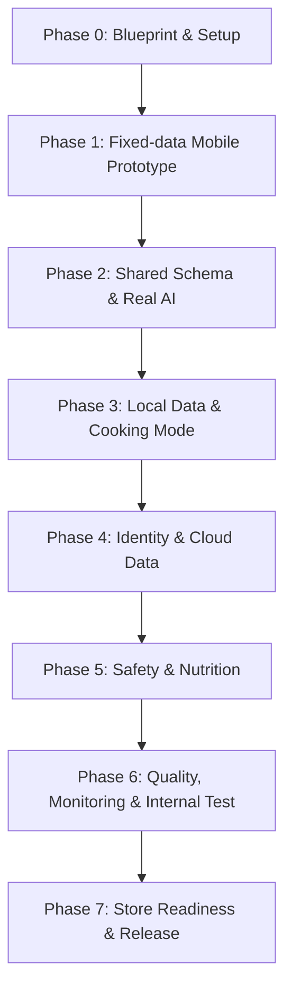

# 00 — Project Master Plan

> 本文定义 AI Kitchen 从蓝图到应用商店发布的总体执行路线、依赖顺序、里程碑、交付物和阶段退出条件。它描述“如何完成项目”，不替代 PRD、架构或专项技术设计。

| 属性 | 内容 |
|---|---|
| 计划版本 | 1.0 |
| 目标周期 | 12–18 周达到可上架质量 |
| 优先平台 | Android，随后 iOS |
| 当前阶段 | Phase 0 文档完成，准备进入 Phase 1 固定数据移动端原型 |
| 最后更新 | 2026-07-27 |

---

## 1. 项目目标

在控制风险、成本和范围的前提下，交付一款真正可在移动端使用的 AI 厨房助手。用户能够选择现有食材，设置人数、时间、厨具、偏好和过敏信息，获得经过结构和安全校验的菜谱，并在烹饪模式中按步骤完成。

### 1.1 成功不是“生成一段文字”

项目成功必须同时满足：

- 用户可以完成核心流程；
- AI 输出结构稳定；
- 食品安全约束不依赖模型自觉；
- 用户数据不会跨账户泄漏；
- 重复点击不会重复计费；
- 错误可定位、可反馈、可重试；
- 生成成本可追踪并有限额；
- App 能在 Android 真机稳定运行；
- 发布材料、隐私说明和实际行为一致；
- 后续扩展无需推翻核心架构。

---

## 2. 工作流总览

阶段原则：先证明核心体验，再增加云数据；先建立结构化输出，再增加安全和营养；先完成 Android，再扩展 iOS；先完成可观测性和回滚，再发布。

---

## 3. 范围分层

### 3.1 P0：可运行原型

目标：证明移动端主流程和真实 AI 生成可以工作。

交付：

- Expo App 骨架；
- 首页、生成条件、生成中、详情、历史基础页面；
- 固定菜谱假数据贯通；
- 食材选择、搜索和手动添加；
- 人数和最大时间；
- 真实服务端生成一道结构化菜谱；
- 统一错误状态；
- 本地最近记录；
- Android 模拟器和一台真机通过。

P0 不要求：正式登录、完整云同步、全面营养数据库、复杂食品安全后台、付费或商店发布。

### 3.2 P1：内部测试版

目标：使 10–20 名用户能够真实使用并反馈。

交付：

- Supabase 匿名身份；
- 云端历史和收藏；
- 过敏、忌口、厨具、辣度、难度和饮食目标；
- 分步烹饪和计时器恢复；
- 食品安全基础规则；
- 反馈和 requestId；
- 限流、日志、成本和基础监控；
- 内部测试包和反馈闭环。

### 3.3 P2：商店发布版

目标：通过发布门禁并具备长期运营基础。

交付：

- 正式账号升级和跨设备同步；
- 账户删除与数据清理；
- 营养来源、计算版本和置信度；
- 隐私政策、用户协议、AI 数据说明；
- 崩溃监控、告警、灰度和回滚；
- Android/iOS 目标真机兼容；
- 商店截图、说明、审核账号和支持页面；
- 发布后监控指标。

---

## 4. Phase 0：Blueprint 与工程准备

### 4.1 目标

在写业务代码前明确领域模型、API、数据库、安全边界和工作流，避免后续 AI 各自生成不兼容实现。

### 4.2 子阶段

#### Phase 0A：核心治理文档

交付：本目录的 10 个第一阶段文档。

退出条件：

- 文档职责明确；
- 目标状态和当前状态分离；
- 核心技术决策记录；
- AI 接手流程可执行；
- 下一阶段文档清单明确。

#### Phase 0B：核心技术专项

交付：

- 数据库设计；
- API 契约；
- 认证与身份；
- Recipe Schema；
- AI Engine；
- Prompt Engineering；
- Rule Engine；
- Food Safety；
- Nutrition；
- Privacy Data Map。

退出条件：

- 相同字段在 API、Schema 和数据库中含义一致；
- RLS、幂等、状态机和保留策略明确；
- AI 失败和安全失败行为明确；
- 主要错误码和测试集明确；
- 不存在互相冲突的决策。

#### Phase 0C：客户端和交付专项

交付：移动端架构、Expo、UI、状态、本地存储、测试、可观测性、部署、商店合规和 AI 工具规则。

退出条件：开发者可以按文档创建仓库而无需重新决定核心边界。

### 4.3 完成状态

截至 2026-07-27，Phase 0A、0B、0C 的计划文档已经完成，AI 工具规则和交接模板已经建立。该结论只代表文档阶段完成，代码仓库和运行环境仍未创建。

### 4.4 原预计周期

1–2 周。后续文档变更继续按专项评审和 ADR 管理。

---

## 5. Phase 1：固定数据移动端原型

### 5.1 目标

不依赖真实 AI 和云端数据，先证明信息架构、交互和页面状态完整。

### 5.2 主要任务

1. 创建 pnpm Monorepo；
2. 初始化 Expo TypeScript 项目；
3. 建立基础路由和四个 Tab；
4. 建立主题、间距、字体和通用组件；
5. 实现食材分类和选择；
6. 实现搜索和手动添加；
7. 实现生成条件；
8. 使用固定 Recipe Fixture 展示生成中和详情；
9. 实现本地最近记录；
10. 实现加载、空、错误和重试状态；
11. 建立格式化、类型检查和单元测试；
12. 在 Android 模拟器和真机验证。

### 5.3 交付物

- `v0.1.0-prototype` 开发包；
- 固定数据主流程；
- 基础组件和页面测试；
- 运行说明；
- 真机验证记录；
- 更新后的状态文档。

### 5.4 退出条件

- 从首页到详情的流程可重复演示；
- 未选择食材时不能生成；
- 返回后条件不丢失；
- 异步页面状态齐全；
- 固定 Recipe 字段缺失不崩溃；
- Android 真机核心流程通过。

### 5.5 预计周期

1–2 周。

---

## 6. Phase 2：共享 Schema 与真实 AI

### 6.1 目标

建立真实服务端生成，但严格限制为一道菜和同步接口。

### 6.2 主要任务

- 创建共享请求、响应、错误和 Recipe Schema；
- 初始化 development Supabase；
- 创建生成 Edge Function；
- 实现输入标准化接口；
- 实现 Provider Adapter；
- 实现 Prompt Builder；
- 实现超时、取消、一次修复和一次重试；
- 实现 Schema 和基础业务校验；
- 建立 requestId、idempotencyKey 和请求状态；
- 建立模型 Mock 和固定评估集；
- App 接入真实 API；
- 实现可操作错误提示。

### 6.3 退出条件

- 结构化成功率在固定测试集上达到目标；
- 相同幂等 Key 不重复调用模型；
- 模型超时和格式错误可恢复；
- App 不包含 AI Key；
- requestId 可贯穿日志；
- 普通请求在目标时间内返回结果或明确错误。

### 6.4 预计周期

2 周。

---

## 7. Phase 3：本地数据与烹饪模式

### 7.1 主要任务

- 本地 Recipe 缓存；
- 生成条件草稿；
- 历史列表；
- 分步烹饪；
- 当前步骤和完成步骤；
- 计时器、暂停、恢复；
- App 后台和被回收后的恢复；
- 屏幕常亮和大字体；
- 数据迁移版本。

### 7.2 退出条件

- 离线可查看已缓存菜谱；
- App 重启后恢复烹饪进度；
- 计时器根据时间戳计算，不依赖持续前台计数；
- 退出烹饪不误删菜谱；
- 本地数据升级不丢失。

### 7.3 预计周期

1–2 周。

---

## 8. Phase 4：身份与云数据

### 8.1 主要任务

- guest 本地身份；
- Supabase anonymous；
- 注册/登录升级；
- profiles 和 preferences；
- 云端 recipes、history 和 favorites；
- RLS；
- guest/anonymous 数据迁移；
- 离线变更队列和同步游标；
- 删除、冲突和重试策略。

### 8.2 退出条件

- 用户只能读写自己的数据；
- 越权测试通过；
- 匿名升级不丢失历史；
- 重复迁移是幂等的；
- 云端失败不会破坏本地可用数据；
- 账户退出和切换不泄露上一个用户数据。

### 8.3 预计周期

1–2 周。

---

## 9. Phase 5：食品安全与营养

### 9.1 主要任务

- 标准食材和别名数据；
- 过敏原映射；
- Business Rule Engine；
- Food Safety Rule Engine；
- BLOCK/WARN/INFO；
- 规则版本和来源；
- 危险输入回归集；
- 营养参考表；
- 克重换算；
- 每道菜和每份营养；
- 来源、置信度和免责声明。

### 9.2 退出条件

- 过敏测试零放行；
- 非食用物阻断；
- 规则服务异常失败关闭；
- 规则更新可回滚；
- 营养结果标明来源和估算状态；
- 营养不可用不阻断安全菜谱返回。

### 9.3 预计周期

1–2 周。

---

## 10. Phase 6：质量、监控与内部测试

### 10.1 主要任务

- 单元、集成、契约和 UI 测试补齐；
- AI 批量评估；
- RLS 和安全专项；
- 崩溃和函数监控；
- P50/P95、超时、成本和规则指标；
- 限流和预算告警；
- 反馈后台或查询流程；
- 10–20 人内部测试；
- 缺陷分级和回归。

### 10.2 退出条件

- 无阻断级主流程缺陷；
- Crash-free 达到内部目标；
- 生成结构成功率和超时率达到目标；
- requestId 可以定位反馈；
- 每日成本可查询并有上限；
- 安全回归通过；
- staging 与 production 配置隔离。

### 10.3 预计周期

2 周。

---

## 11. Phase 7：商店准备与发布

### 11.1 主要任务

- 正式身份和账户删除；
- 隐私政策、用户协议和 AI 数据说明；
- Google Play 数据安全申报；
- App 图标、截图、简介和支持页面；
- EAS production 构建和签名；
- 版本号和发布说明；
- 审核账号和审核说明；
- 灰度、监控和回滚；
- iOS 兼容和后续提交。

### 11.2 退出条件

- 发布门禁全部通过；
- 隐私材料与真实数据流一致；
- 账户删除真实可用；
- production Key 和数据隔离；
- 上一版本构建可回滚；
- Android 封闭测试通过；
- 发布后指标和告警已启用。

### 11.3 预计周期

2–4 周。

---

## 12. 第一周执行计划

| 天 | 任务 | 验收 |
|---|---|---|
| Day 1 | 安装工具、创建仓库和 Expo 项目 | Android 模拟器显示首页，首次提交 |
| Day 2 | 目录、路由、基础页面 | 导航无阻断 |
| Day 3 | 食材分类和选择 | 选中、取消、计数正确 |
| Day 4 | 搜索和手动添加 | 重复和非法输入被处理 |
| Day 5 | 人数、时间和厨具草稿 | 返回后数据保留 |
| Day 6 | 固定 Recipe 详情 | 完整主流程可演示 |
| Day 7 | 回归、真机、状态和开发包 | `v0.1.0-prototype` 候选 |

第一周计划只能在 Phase 0 专项文档完成并通过一致性审核后启动。

---

## 13. 工作流依赖

| 工作流 | 前置依赖 | 阻塞后续 |
|---|---|---|
| Recipe Schema | 产品需求、食材模型 | API、AI、UI、数据库 |
| Database | 身份、Schema、保留策略 | 云历史、收藏、日志 |
| API Contract | Schema、错误模型 | App 接入、契约测试 |
| Auth | 数据所有权、迁移策略 | 云同步、账户删除 |
| AI Engine | Schema、API、规则接口 | 真实生成 |
| Food Safety | 标准食材、规则引擎 | P1 内测和发布 |
| Nutrition | 标准食材、单位换算 | P2 营养展示 |
| Observability | requestId、错误码 | 内测反馈、发布 |
| Store Compliance | 数据地图、账户删除 | 商店提交 |

不得在关键前置契约未完成时将实现散落到多个模块。

---

## 14. 质量指标

### 14.1 产品

- 首次生成完成率；
- 菜谱收藏率；
- 烹饪模式开始率和完成率；
- 反馈率和负反馈类别；
- 次日和七日留存。

### 14.2 AI

- JSON/Schema 成功率；
- 修复调用率；
- 业务规则失败率；
- 安全 BLOCK/WARN 率；
- P50/P95 延迟；
- 单次 Token 和成本。

### 14.3 稳定性和安全

- Crash-free users；
- Edge Function 错误率；
- RLS 越权测试；
- 重复计费事件；
- 过敏测试放行数；
- 生产密钥扫描结果。

---

## 15. 项目角色

初期可能由同一人承担多个角色，但职责仍需分离：

| 角色 | 主要责任 |
|---|---|
| Product Owner | 范围、优先级、用户验收 |
| CTO/Architect | 架构、边界、决策和技术风险 |
| Mobile Engineer | Expo App、交互、本地状态 |
| Backend Engineer | API、Auth、数据库、生成服务 |
| AI Engineer | Prompt、Provider、评估和成本 |
| Safety Reviewer | 食品安全来源、规则和高风险审核 |
| QA | 测试计划、回归、真机和发布门禁 |
| Release Owner | 构建、签名、商店、监控和回滚 |

AI 可以辅助每个角色，但不能替代食品安全来源审核、隐私责任和发布签字。

---

## 16. 风险和预案

| 风险 | 预防 | 触发后的动作 |
|---|---|---|
| 模型输出不稳定 | Schema、评估、有限修复 | 回滚 Prompt/模型，关闭生成 |
| 过敏放行 | 规则引擎、固定测试 | 立即总开关、事故分析、规则修复 |
| 成本激增 | 限流、预算、幂等 | 降低额度、切模型、暂停生成 |
| 数据越权 | RLS 和测试 | 禁用受影响接口、修复策略、审计 |
| 迁移失败 | staging、备份、兼容发布 | 停止发布、回滚代码或恢复数据 |
| 依赖升级破坏 | 独立提交和锁版本 | 回退依赖提交 |
| 范围失控 | 功能池和变更记录 | 移除等量功能或推迟版本 |
| 审核拒绝 | 提前准备合规 | 按拒绝原因修正，不临时伪装功能 |

---

## 17. 变更控制

新增需求必须说明：

- 对哪个用户问题有价值；
- 属于 P0、P1、P2 还是后续；
- 需要哪些数据、API 和权限；
- 是否增加 AI 成本或安全风险；
- 会推迟哪个里程碑；
- 是否需要移除等量范围；
- 是否触发 `DECISIONS.md`。

未经评估，不得将功能池项目插入当前冲刺。

---

## 18. 项目完成定义

“整个 Blueprint 完成”意味着：

- 第一至第四阶段文档齐全；
- 文档之间没有关键冲突；
- 所有重大决策可追踪；
- 新 AI 能够从状态文档继续；
- 代码任务能够从文档导出明确验收；
- 数据、AI、安全、测试和发布均有专项设计；
- 文档不是一次性说明，而有明确维护规则。

“产品完成”则必须满足 P2 发布门禁，二者不能混淆。
