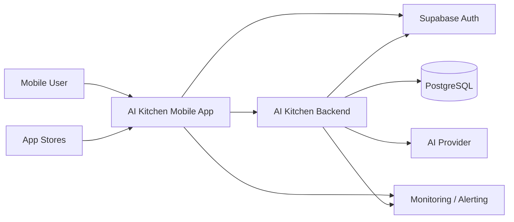
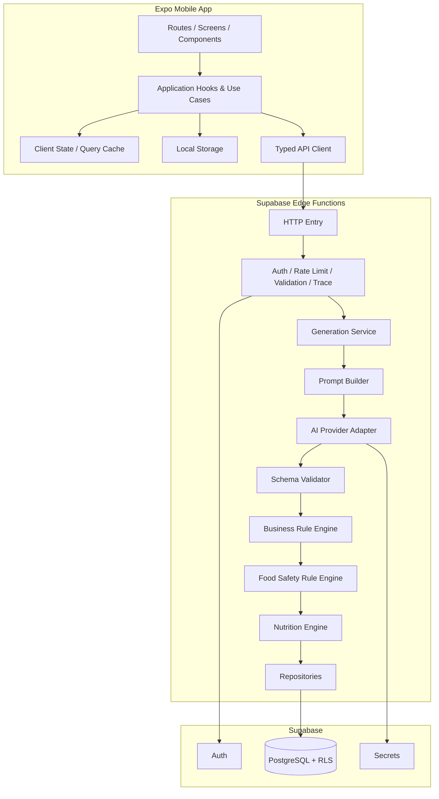
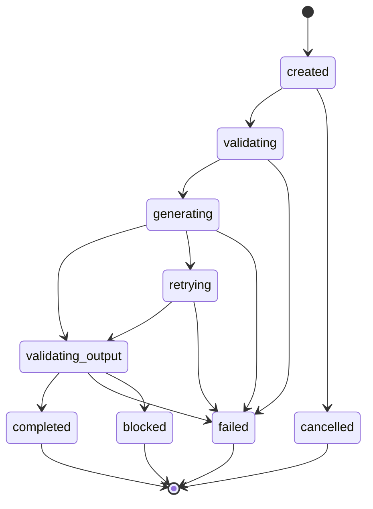

# 02 — System Architecture

> 本文定义 AI Kitchen 的目标系统架构、组件边界、信任模型、数据流、环境、失败处理和扩展原则。当前尚未正式实现，因此文中“系统采用”代表已确认的目标基线，不代表代码已经存在。

> 实施更正（2026-07-28）：正式运行后端已由 D-016 调整为内网 Node.js/Fastify + MySQL；本文中 Supabase/PostgreSQL 描述保留为历史目标设计，不代表当前正式实现。

| 属性 | 内容 |
|---|---|
| 架构版本 | 1.0 |
| 架构状态 | Target / Accepted Baseline |
| 首发规模 | P0–P2 单体模块化架构 |
| 最后更新 | 2026-07-24 |

---

## 1. 架构目标

架构必须支持：

- 移动端快速迭代；
- Android 和 iOS 共享主要代码；
- 服务端保护 AI Key 和高权限数据库能力；
- AI 输出严格结构化；
- 食材、过敏、安全和营养使用稳定领域模型；
- 用户数据隔离；
- 请求幂等和成本追踪；
- 模型供应商可替换；
- 安全规则可维护和版本化；
- 开发、测试、正式环境隔离；
- 小团队和 AI 编程工具可理解、可测试、可回滚。

首版不追求微服务。P0–P2 使用模块化单体服务边界，只有明确的规模、隔离或部署需求出现时才拆分。

---

## 2. 系统上下文



外部系统：

- AI Provider；
- Supabase 平台；
- 崩溃和日志监控；
- EAS Build 和应用商店；
- 未来可能的营养数据源或食品安全来源。

任何外部系统都必须通过适配器或同步流程进入，不得让第三方类型扩散到整个代码库。

---

## 3. 逻辑架构



---

## 4. 仓库架构

```text
ai-kitchen/
├── apps/
│   └── mobile/
│       ├── app/                    # Expo Router 路由
│       ├── src/
│       │   ├── components/
│       │   ├── features/
│       │   ├── hooks/
│       │   ├── services/
│       │   ├── storage/
│       │   ├── theme/
│       │   └── test/
│       └── app.config.ts
├── packages/
│   ├── shared/
│   │   ├── schemas/
│   │   ├── errors/
│   │   ├── constants/
│   │   └── types/
│   ├── domain/
│   │   ├── ingredients/
│   │   ├── recipes/
│   │   ├── generation/
│   │   ├── safety/
│   │   └── nutrition/
│   └── config/
├── supabase/
│   ├── functions/
│   │   ├── generate-recipe/
│   │   ├── submit-feedback/
│   │   └── account-delete/
│   ├── migrations/
│   └── seed/
├── tests/
│   ├── ai-cases/
│   ├── contracts/
│   ├── security/
│   └── e2e/
├── scripts/
└── docs/
```

### 4.1 Monorepo 原因

- App、Edge Function 和测试共享 Schema；
- 领域规则可跨环境复用；
- 一个提交可以原子更新契约和实现；
- AI 更容易看到完整影响范围；
- 小团队不需要维护多个仓库版本协调。

首版使用工作区管理即可，不因追求工具复杂度强制引入大型构建编排系统。

---

## 5. 移动端架构

### 5.1 层次

- **Routes/Screens**：页面组装、导航参数和页面级状态；
- **Feature Components**：特定业务组件；
- **Application Hooks**：调用用例、组合 Query 和本地状态；
- **Typed API Client**：请求、错误归一化和响应 Schema 校验；
- **Local Storage Adapter**：缓存、草稿、计时器和迁移；
- **Shared/Domain**：不依赖 React Native 的类型和规则。

### 5.2 状态分类

| 状态 | 归属 | 示例 |
|---|---|---|
| 服务端状态 | Query Cache | 历史、收藏、请求状态 |
| 会话 UI 状态 | 轻量状态 | 当前食材、筛选、弹窗 |
| 持久本地状态 | Storage Adapter | 草稿、缓存、烹饪进度 |
| 导航状态 | Expo Router | 页面和参数 |
| 表单状态 | 表单层 + Schema | 人数、时间、偏好 |

禁止把所有数据塞入一个全局 Store。服务端状态不应手工复制成另一份长期状态。

### 5.3 本地存储边界

允许存储：

- guest ID；
- 当前选择和条件草稿；
- 最近 Recipe Snapshot；
- 烹饪进度和计时器时间戳；
- 同步游标和待处理操作；
- 必要的认证安全存储数据。

不得把 Service Role Key、AI Key、完整敏感日志或其他用户数据留在普通本地存储。

---

## 6. 服务端架构

### 6.1 Edge Function 入口

入口层负责：

- 生成/读取 requestId；
- 解析身份；
- 限流；
- 请求大小限制；
- Schema 校验；
- 幂等检查；
- 统一错误映射；
- 记录安全的 trace；
- 调用应用服务。

入口层不应包含大型 Prompt 或具体业务流程。

### 6.2 Application Service

`RecipeGenerationService` 负责一次完整生成编排：

1. 创建或读取 generation request；
2. 标准化输入；
3. 输入安全预检；
4. 构建 Prompt；
5. 调用 Provider；
6. 解析和校验；
7. 必要时执行一次修复；
8. 运行业务规则；
9. 运行食品安全规则；
10. 运行营养处理；
11. 保存结构化实体和快照；
12. 更新状态、用量和错误；
13. 返回统一响应。

### 6.3 领域服务

领域服务应尽量是纯 TypeScript：

- `normalizeIngredients`；
- `validateRecipeTime`；
- `validateAppliances`；
- `detectAllergens`；
- `evaluateFoodSafety`；
- `calculateNutrition`；
- `scaleRecipeServings`。

这使规则可在不启动数据库和 App 的情况下单测。

---

## 7. AI 生成架构

### 7.1 Provider Adapter

业务层接口示意：

```ts
interface RecipeModelProvider {
  generate(input: ProviderRecipeRequest, signal: AbortSignal): Promise<ProviderRecipeResult>;
}
```

Adapter 内部处理：

- SDK 初始化；
- 模型名称；
- 结构化输出能力；
- 超时和取消；
- Token 用量；
- 供应商错误；
- 原始响应脱敏；
- 重试分类。

### 7.2 Prompt Builder

输入为已经标准化和校验的领域对象，输出为 Provider Request。Prompt 由固定章节组成：

- 系统角色和能力边界；
- Recipe Schema；
- 用户已有食材；
- 人数、时间和厨具；
- 偏好、忌口和过敏；
- 缺少食材规则；
- 食品安全提示要求；
- 禁止医疗承诺；
- 示例；
- 版本元数据。

用户文本不得直接插入系统指令区。

### 7.3 校验顺序

```text
JSON Syntax
→ Shared Schema
→ Business Consistency
→ Allergen and Food Safety
→ Nutrition Attachment
```

前一步失败时不得跳到后一步假装通过。

### 7.4 修复与重试

- JSON/Schema 可修复错误：最多一次修复调用；
- 供应商临时错误：总自动重试最多一次；
- 安全阻断：不是“修复错误”，可用新请求重新生成；
- 输入无效：不调用模型；
- 超过预算或限流：不调用模型；
- 幂等命中：返回已有状态。

---

## 8. 数据架构

### 8.1 数据分类

| 类型 | 示例 | 主存储 |
|---|---|---|
| 身份数据 | auth user、profile | Supabase Auth + PostgreSQL |
| 用户偏好 | 过敏、忌口、厨具 | PostgreSQL + 本地缓存 |
| 标准参考 | 食材、别名、规则、营养 | PostgreSQL，版本化 |
| 业务数据 | recipes、steps、favorites | PostgreSQL |
| 过程数据 | generation_requests | PostgreSQL |
| 客户端状态 | 草稿、进度、同步游标 | 本地存储 |
| 观测数据 | 错误、性能、成本 | 监控与结构化日志 |

### 8.2 规范化与快照

菜谱使用混合策略：

- `recipes` 保存主信息和版本；
- `recipe_ingredients`、`recipe_steps` 支持查询、统计和规则；
- `recipe_snapshot` 保存生成时的完整展示结构，保证历史可还原；
- 原始模型响应仅在最短必要周期内脱敏保存或不保存。

不是“全部拆表”或“全部 JSON”二选一。

### 8.3 数据所有权

- 用户生成的 recipe、favorite、preference 和 feedback 关联 `owner_id`；
- RLS 使用 `auth.uid()`；
- 公共标准食材和规则只读开放或通过服务端读取；
- 管理写入不通过普通用户客户端；
- 删除账户流程区分必须删除、允许匿名化和依法保留的数据。

---

## 9. 请求状态机



状态变化必须原子记录。最终状态至少包含：完成、失败、阻断和取消。

---

## 10. API 架构

### 10.1 首批接口域

- `/v1/recipes/generate`
- `/v1/generation-requests/{requestId}`
- `/v1/recipes`
- `/v1/recipes/{recipeId}`
- `/v1/favorites`
- `/v1/preferences`
- `/v1/feedback`
- `/v1/account/delete`

最终字段以 `04_API_CONTRACT.md` 为准。

### 10.2 错误模型

```json
{
  "requestId": "uuid",
  "error": {
    "code": "AI_TIMEOUT",
    "message": "本次生成时间较长，请重新尝试",
    "retryable": true,
    "details": null
  }
}
```

错误码属于共享契约。前端不解析第三方错误文本判断业务。

---

## 11. 身份架构

### 11.1 状态

- guest：本地随机 ID，无云端所有权；
- anonymous：Supabase Auth 匿名用户，可受 RLS 保护；
- registered：绑定正式登录方式，支持跨设备。

### 11.2 升级原则

优先保留同一个 `auth.users.id` 完成匿名绑定。若平台限制需要迁移，则使用服务端受控迁移并保证幂等、数量校验和本地回滚快照。

### 11.3 登录不是核心价值门槛

用户在 guest 状态下可使用 P0 核心流程。需要云同步、跨设备或正式账号能力时再引导升级。

---

## 12. 食材标准化架构

### 12.1 实体

- `ingredients`：标准 ID、代码、名称、类别、默认单位、过敏组；
- `ingredient_aliases`：别名、语言、地区、优先级；
- 用户输入保留原显示名；
- 识别结果保存标准 ID、匹配方式和置信度。

### 12.2 流程

```text
Raw User Text
→ Trim / Normalize Characters
→ Exact Alias Match
→ Fuzzy Candidate Match
→ User Confirmation or Custom Ingredient
→ Canonical ID + Original Display Name
```

无法识别的自定义食材可以参与菜谱生成，但不能自动获得高置信度营养或过敏映射。

---

## 13. 食品安全架构

### 13.1 规则系统

规则输入包括：

- 标准食材；
- 原始自定义食材；
- 用户过敏和人群信息；
- 菜谱步骤、温度、时间和储存说明；
- 地区和规则版本。

输出：

- `BLOCK`；
- `WARN`；
- `INFO`；
- 命中规则 ID 和版本；
- 用户可见提示；
- 内部诊断。

### 13.2 失败策略

食品安全规则引擎异常：生成请求进入失败或阻断状态，禁止展示候选内容。营养引擎异常：返回安全菜谱，营养标记不可用。

---

## 14. 营养架构

计算优先使用标准数据库按克重处理：

```text
ingredient amount
→ standardized unit
→ edible grams
→ reference per 100g
→ total recipe nutrients
→ per serving nutrients
```

每次结果记录：

- source；
- confidence；
- calculationVersion；
- 克重是否估算；
- 生重/熟重状态；
- total/perServing。

AI 估算只能作为低置信度降级，并必须明确标记。

---

## 15. 本地、离线与同步

### 15.1 离线能力

- 查看缓存菜谱；
- 查看烹饪进度；
- 编辑条件草稿；
- 收藏/删除进入待同步队列；
- 不能新生成 AI 菜谱。

### 15.2 同步原则

- 操作拥有本地唯一 ID；
- 上传幂等；
- 记录服务端更新时间和同步游标；
- 冲突使用明确规则；
- 不静默覆盖用户较新操作；
- 切换用户清理或隔离缓存。

---

## 16. 计时器架构

计时器状态使用绝对时间：

```text
recipeId
currentStep
completedSteps
timerStartedAt
timerDurationSeconds
pausedAt
accumulatedPauseSeconds
updatedAt
```

显示剩余时间由当前时间计算。不得依赖 JavaScript 每秒递减作为唯一事实来源，因为 App 可能进入后台或被系统暂停。

---

## 17. 环境架构

| 环境 | 用途 | 数据 | 密钥 | 构建 |
|---|---|---|---|---|
| development | 个人开发 | 测试数据 | 开发 Key | 开发包 |
| staging | 内测和预发布 | 隔离测试数据 | 测试 Key | 内部测试包 |
| production | 正式用户 | 正式数据 | 生产 Key | 商店版本 |

环境隔离包括：

- Supabase 项目或明确隔离实例；
- 数据库；
- Auth 用户；
- AI Key 和预算；
- 监控项目；
- App 配置和包标识；
- Deep Link 和回调；
- 发布渠道。

不得用前端变量切换到任意生产环境。

---

## 18. 可观测性架构

### 18.1 Trace

`requestId` 从客户端创建或读取，贯穿：

- App 事件；
- API 请求；
- Edge Function；
- generation_requests；
- Provider 调用；
- 规则结果；
- 用户反馈。

### 18.2 指标

- 产品：生成、收藏、完成、留存；
- AI：结构成功、修复、规则失败、延迟；
- 安全：BLOCK/WARN、举报；
- 成本：Token、单次、每日、用户均；
- 稳定：Crash-free、API 和函数错误；
- 数据：同步失败、越权测试、账户删除。

### 18.3 日志禁区

- 密码；
- Access/Refresh Token；
- API Key；
- 完整邮箱；
- 不必要的完整过敏和健康输入；
- 未脱敏原始 AI 对话；
- 生产用户完整菜谱输入，除非有明确保留和访问策略。

---

## 19. 性能和容量

P0–P2 以小规模用户为目标，优先正确性和成本可控：

- 单菜同步生成；
- 45 秒 App 等待上限；
- 30–35 秒模型超时；
- 最多一次修复和一次自动重试；
- 历史分页；
- 标准数据缓存；
- 相同请求短期复用仅在隐私和正确性允许时使用；
- 后续周菜单、图片和批量任务使用异步 `jobId`。

拆分微服务的触发条件：独立扩展需要、不同安全边界、部署频率冲突、单体启动或测试成本失控。仅“看起来更企业级”不是理由。

---

## 20. 故障与降级

| 故障 | 行为 |
|---|---|
| 无网络 | 查看缓存，禁止新生成，允许稍后重试 |
| AI 超时 | 统一错误，可有限重试 |
| Provider 故障 | 备用模型或错误，受预算和配置控制 |
| 输出无效 | 一次修复，仍失败则返回错误 |
| 安全规则异常 | 失败关闭，不展示结果 |
| 营养异常 | 返回安全菜谱，营养 unavailable |
| 数据库写入失败 | 不盲目再次生成，查询幂等状态 |
| Auth 失效 | 刷新或引导重新登录，不泄露缓存 |
| 监控故障 | 不阻断核心流程，但本地最小诊断 |

---

## 21. 安全边界

### 21.1 客户端不可信

客户端校验只提升体验。所有权限、限流、输入和安全规则必须在服务端再次执行。

### 21.2 AI 不可信

即使结构化输出成功，仍需业务和食品安全校验。模型不能访问高权限数据库 Key。

### 21.3 数据库最小权限

普通用户通过 RLS 操作自身数据。高权限操作通过服务端受控路径。服务端也应尽量使用最小权限而非到处使用 Service Role。

### 21.4 Prompt 注入

用户食材和文本作为数据序列化；限制长度；不允许用户定义系统角色、输出格式或忽略安全规则；服务端再次校验所有结果。

---

## 22. 测试架构

- Shared/Domain：快速单元测试；
- Edge Function：模型 Mock + 测试数据库集成；
- API：契约测试；
- RLS：用户 A/B 越权测试；
- Mobile：组件和页面测试；
- E2E：固定数据主流程，真实 AI 使用受控测试；
- AI：离线固定数据集批量评估；
- Safety：危险输入和过敏专项；
- Release：目标 Android/iOS 真机矩阵。

测试数据不得使用真实用户数据。

---

## 23. 架构演进

### 23.1 可调整

- AI Provider；
- 监控供应商；
- UI 风格；
- 具体轻量状态库；
- 营养数据源；
- 运营和会员策略。

### 23.2 需要 ADR

- App 直接调用 AI；
- 更换主数据库；
- 取消共享 Schema；
- 改变身份所有权；
- 将规则交给模型；
- 安全失败开放；
- 引入异步任务；
- 拆分微服务；
- 多地区数据部署；
- 引入付费和订阅。

### 23.3 扩展功能如何接入

- 拍照识别：作为 Ingredient Recognition Adapter 输出候选标准食材，不直接写入最终食材；
- 周菜单：使用异步 Job，复用 Recipe Schema 和安全规则；
- 购物清单：从缺少食材和计划菜谱派生；
- 多语言：显示名称和别名国际化，标准 ID 不变；
- 语音：作为 UI 输入/输出层，不改变领域和安全规则；
- 图片生成：与菜谱生成解耦，不能阻断文字菜谱。

---

## 24. 架构验收清单

编码前必须能回答：

- [ ] Recipe Schema 的稳定字段是什么？
- [ ] API 与数据库如何映射？
- [ ] 用户所有权如何通过 RLS 保证？
- [ ] 相同请求如何防止重复计费？
- [ ] AI 失败、输出失败和安全阻断如何区分？
- [ ] 标准食材和自定义食材如何共存？
- [ ] 安全规则异常时为什么不会展示结果？
- [ ] 营养不可用时如何降级？
- [ ] guest 数据如何升级？
- [ ] App 被回收后计时器如何恢复？
- [ ] development、staging、production 如何隔离？
- [ ] 如何回滚 Prompt、模型、代码和数据库？

这些问题在专项文档中明确前，不应开始大规模实现。
