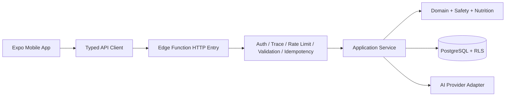

# 04 — API Contract

> AI Kitchen 对外 API 契约基线。本文定义移动端与服务端之间的 HTTP 边界、资源模型、请求与响应格式、身份上下文、幂等、错误码、分页、兼容策略、安全要求、可观测性和契约测试。本文是移动端、Edge Functions、共享 Schema、Auth、Recipe Schema、AI Engine 与数据库实现的共同约束。

| 属性 | 内容 |
|---|---|
| 文档版本 | 1.0.0 |
| 状态 | Draft / Ready for Review |
| API 风格 | Versioned REST + JSON |
| 传输 | HTTPS only |
| 适用阶段 | P0–P2 |
| 最后更新 | 2026-07-24 |
| 实施状态 | Generation API v1 契约、Edge Function 源码和 Mobile Adapter 已实现；尚未部署 Supabase |

---

## 1. 文档目标

本契约解决以下问题：

- App、Edge Function、共享 Schema 和数据库对同一字段使用一致语义；
- AI 生成请求在网络重试、用户连点和服务端超时下不会重复生成或重复计费；
- guest、anonymous、registered 三类身份拥有一致且可升级的 API 体验；
- 所有错误都能被前端稳定识别，而不是依赖供应商文案或 HTTP 文本；
- API 可以在旧版本 App 仍在线时进行兼容演进；
- 食品安全阻断、权限拒绝、模型超时和普通输入错误拥有不同处理方式；
- requestId 可以贯穿 App、API、数据库、模型调用、反馈和日志；
- 后端内部字段、AI Provider 细节、数据库行和敏感数据不会直接泄漏给客户端；
- API 设计足够简单，适合 P0–P2 单体模块化架构，同时为长任务、周菜单和图片生成预留演进空间。

本文描述的是**目标契约**，不是已经上线的接口。只有共享 Schema、OpenAPI、服务端实现、契约测试和至少一个 App 调用全部通过后，对应端点才能标记为 `IMPLEMENTED`。

---

## 2. 上游决策与不可破坏边界

本文继承以下已接受决策：

- `D-003`：App 不直接调用 AI Provider；
- `D-004`：P0–P2 使用 Supabase Edge Functions；
- `D-005`：PostgreSQL + RLS 是主数据系统；
- `D-006`：Monorepo + 共享 Schema；
- `D-007`：AI 输出通过语法、Schema、业务和食品安全四层校验；
- `D-008`：食品安全失败关闭；
- `D-009`：标准食材 ID 与别名分离；
- `D-010`：guest → anonymous → registered 身份路径；
- `D-011`：单菜生成以同步流程为主，长任务未来异步；
- `D-012`：development、staging、production 完全隔离；
- `D-013`：`requestId` + `idempotencyKey` 全链路使用；
- `D-014`：关系规范化与版本化 Recipe Snapshot 并存。

因此 API 不得：

- 接收或返回 AI Provider API Key；
- 让客户端传入 `ownerId` 决定数据所有权；
- 直接返回数据库 `select *` 结果；
- 把供应商原始错误、堆栈或 Prompt 返回给 App；
- 允许客户端声明“该菜谱已通过食品安全”；
- 把自由文本 AI 输出作为成功响应；
- 依赖按钮禁用代替服务端幂等；
- 使用设备 ID、IP 或自定义 Header 作为唯一可信身份；
- 在未升级主版本的情况下改变已有字段类型或语义；
- 在 production 暴露调试端点、原始模型输出或内部规则内容。

---

## 3. 为什么采用 REST + JSON

### 3.1 项目资源和动作边界清晰

首版 API 的主要对象是：

- 生成请求；
- 菜谱；
- 食材参考数据；
- 用户偏好；
- 收藏；
- 反馈；
- 账户数据操作。

这些对象可以自然映射到 HTTP 资源和标准方法。移动端主流程不需要任意图查询，也不需要让客户端自由拼装数据库关系。

### 3.2 为什么 P0–P2 不使用 GraphQL

GraphQL 能减少某些页面的多请求，但首版会增加：

- Schema、Resolver、鉴权和复杂度控制；
- Query 深度、字段成本与缓存策略；
- RLS 之外的字段级授权风险；
- 对 AI 生成动作、幂等键和状态机的额外约定；
- 非专业开发者和 AI 编程工具的调试成本。

AI Kitchen 的首要风险是安全、输出质量、幂等和数据所有权，不是查询字段过多。REST 更容易建立稳定契约、日志、限流和端到端测试。

### 3.3 为什么不直接使用 Supabase 自动生成的数据 API

Supabase 数据 API 适合标准 CRUD，但本项目不能让 App 直接完成以下高风险流程：

- AI Prompt 构建和模型调用；
- 输入标准化和安全预检；
- 请求幂等和成本控制；
- 食品安全失败关闭；
- 账户删除编排；
- 反馈与内部严重等级隔离；
- Recipe Snapshot 与规范化关系表的事务写入。

普通用户数据即使受 RLS 保护，也应通过明确的应用 API 暴露，而不是把数据库结构当作公共契约。Supabase Client 可用于 Auth 会话，但业务数据访问默认经自有 Edge Function。

### 3.4 为什么不用 tRPC 作为唯一公共契约

tRPC 对同一 TypeScript 仓库开发效率高，但它会把 TypeScript 过程类型与网络契约过度绑定，也不利于：

- 未来非 TypeScript 客户端；
- 独立契约审查；
- App 商店旧版本兼容；
- OpenAPI 安全扫描和外部调试；
- 明确的 HTTP 缓存、状态码和幂等行为。

本项目采用 Zod/TypeScript 共享 Schema，同时生成或校验 OpenAPI 3.1；不把某个 RPC 框架作为长期唯一事实来源。

---

## 4. API 架构边界



### 4.1 HTTP Entry 只负责跨领域能力

入口层负责：

- 解析路径和方法；
- 读取或生成 requestId；
- 解析认证会话；
- 建立 subject；
- 检查 Content-Type 和请求大小；
- 解析 JSON；
- 执行请求 Schema 校验；
- 检查速率限制和预算；
- 执行幂等占位或重放；
- 调用应用服务；
- 映射统一响应和错误；
- 写安全日志。

入口层不得直接拼 Prompt、写复杂 SQL 或实现食品安全规则。

### 4.2 应用服务负责业务编排

例如 `RecipeGenerationService` 负责：

1. 创建或读取生成请求；
2. 输入标准化；
3. 输入安全预检；
4. 调用 AI Engine；
5. 校验候选 Recipe；
6. 运行业务和食品安全规则；
7. 处理营养数据；
8. 事务保存；
9. 更新请求状态和成本；
10. 返回 API DTO。

### 4.3 API DTO 与数据库行分离

```text
HTTP JSON DTO
    ↕ 显式 Mapper
Domain Command / Entity
    ↕ Repository Mapper
Database Row
```

禁止：

```ts
return supabase.from("recipes").select("*");
```

必须通过显式 DTO 映射移除：

- `owner_id`；
- `provider_code` 和内部模型信息（普通用户默认不需要）；
- 内部错误和阻断原因；
- `guest_subject_hash`；
- 成本字段；
- RLS/审计元数据；
- 未公开的规则 ID；
- 原始 AI 输出。

---

## 5. Base URL 与环境

### 5.1 逻辑地址

```text
development  https://<development-project>.supabase.co/functions/v1/api
staging      https://<staging-project>.supabase.co/functions/v1/api
production   https://<production-project>.supabase.co/functions/v1/api
```

若未来使用自定义域名，推荐：

```text
https://api.example.com/v1/...
```

真实域名在部署阶段确定，不写死在共享业务代码中。

### 5.2 环境选择

- development App 只能调用 development；
- staging 内测包只能调用 staging；
- production 商店包只能调用 production；
- 环境由构建配置决定，不允许普通用户在生产 App 切换；
- 不允许 production Key、URL 和数据进入测试快照；
- API 响应不返回其他环境地址。

### 5.3 HTTPS

- 所有环境只允许 HTTPS；
- 不支持明文 HTTP 降级；
- Token 不得放在 URL Query；
- 敏感响应建议设置 `Cache-Control: no-store`；
- 移动端证书固定不是 P0 强制项，若未来引入，必须定义证书轮换和旧版本兼容。

---

## 6. API 版本与 Schema 版本

本项目存在三种不同版本，不得混用。

| 版本 | 示例 | 作用 |
|---|---|---|
| API 主版本 | `/v1` | HTTP 资源、字段和行为兼容边界 |
| 响应 Envelope 版本 | `api.v1` | 通用成功/失败外壳 |
| 领域 Schema 版本 | `recipe.v1.0.0` | Recipe Snapshot 的精确结构 |

### 6.1 路径主版本

首版使用：

```text
/v1/recipes
/v1/recipes/generate
```

只有破坏兼容的变更才创建 `/v2`。新增可选字段、增加新端点或增加新的错误码通常不需要新主版本。

### 6.2 兼容变更

允许在 `/v1` 内完成：

- 新增可选响应字段；
- 新增新的端点；
- 新增新的可选请求字段，且缺省行为与旧版一致；
- 新增错误码，前端有未知错误兜底；
- 扩展枚举值，但客户端必须将未知值显示为通用状态；
- 增加分页过滤条件。

### 6.3 破坏性变更

以下变化需要新 API 主版本或完整兼容迁移：

- 删除字段；
- 字段从可空变成必填；
- 改变字段类型；
- 改变已有枚举值含义；
- 改变时间、金额或单位语义；
- 改变成功/失败状态码，使旧 App 错误处理失效；
- 把同步完成改为必须异步而无兼容响应；
- 改变分页排序导致游标含义失效。

### 6.4 Recipe Schema 独立版本

`Recipe` 响应必须包含：

```json
{
  "schemaVersion": "recipe.v1.0.0"
}
```

API `/v1` 可以同时返回多个可兼容 Recipe Schema 小版本，但服务端必须确保当前受支持 App 能解析。Recipe 结构的最终定义由 `10_RECIPE_SCHEMA.md` 锁定。

### 6.5 弃用流程

弃用旧端点时：

1. 在 CHANGELOG 记录；
2. 服务端保留旧端点至少覆盖当前支持的 App 版本窗口；
3. 响应可增加标准 `Deprecation` 和 `Sunset` Header；
4. 监控旧版本真实调用量；
5. App 更新并验证；
6. 到达下线条件后停止；
7. 破坏性删除必须有回滚方案。

不得只因“新版已经发布”立即关闭旧 API，因为应用商店用户不会同步升级。

---

## 7. JSON、命名和编码规范

### 7.1 Content-Type

请求：

```http
Content-Type: application/json; charset=utf-8
Accept: application/json
```

服务端只接受有效 UTF-8 JSON。非 JSON 请求返回 `415 UNSUPPORTED_MEDIA_TYPE`。

### 7.2 字段命名

公共 JSON 使用 `camelCase`：

```json
{
  "maxTimeMinutes": 30,
  "idempotencyKey": "..."
}
```

数据库使用 `snake_case`，通过 Mapper 转换。禁止在同一 API 混用两种格式。

### 7.3 空值与缺失

- 字段不适用或未知时优先省略；
- 字段有明确“无值”语义时可以返回 `null`；
- 空数组表示“已知没有元素”；
- 不用空字符串代表 `null`；
- 不用 `0` 代表未知时间、重量或金额；
- 请求中省略可选字段表示使用默认行为；显式 `null` 是否允许由 Schema 单独定义。

### 7.4 时间

所有 API 时间点使用 RFC 3339 UTC：

```json
"createdAt": "2026-07-24T06:30:15.123Z"
```

纯日期使用：

```json
"date": "2026-07-24"
```

时长使用明确单位后缀：

```json
"totalTimeMinutes": 30,
"durationSeconds": 300,
"retryAfterSeconds": 60
```

不得使用无单位字段如 `duration: 5`。

### 7.5 金额与成本

普通用户 API 默认不返回 AI 成本。内部运营接口若未来返回金额，必须使用：

```json
{
  "amount": "0.012345",
  "currency": "USD"
}
```

金额使用十进制字符串，避免 JSON 浮点误差。

### 7.6 标识

- 对外资源 ID 使用 UUID 字符串；
- 不暴露数据库自增数量；
- `requestId` 与 `idempotencyKey` 都是 UUID，但语义不同；
- 任何 ID 都必须通过格式校验；
- 不允许客户端传入 `ownerId`。

### 7.7 数组和顺序

- `ingredients`、`steps` 按展示顺序返回；
- 列表 API 的排序必须在契约中固定；
- 服务端不得依赖 JSON 对象字段顺序；
- 去重必须基于明确业务键，不基于显示文案。

---

## 8. 通用请求 Header

| Header | 必填 | 说明 |
|---|---:|---|
| `Authorization` | 视端点 | `Bearer <Supabase access token>` |
| `X-Request-Id` | 推荐 | 客户端生成 UUID；缺失时服务端生成 |
| `Idempotency-Key` | 仅写入型关键动作 | UUID；生成接口强制 |
| `X-Client-Version` | 推荐 | App 语义版本，如 `0.1.0` |
| `X-Client-Build` | 推荐 | 平台构建号 |
| `X-Platform` | 推荐 | `android` / `ios` |
| `X-Device-Locale` | 可选 | BCP 47，如 `zh-CN`，不作为身份 |
| `Accept-Language` | 可选 | 响应展示语言偏好 |

### 8.1 `Authorization`

```http
Authorization: Bearer eyJ...
```

规则：

- Token 只通过 Header 发送；
- 服务端验证签名、受众、过期和项目环境；
- 不把 Token 写入日志；
- 客户端不得使用 Service Role Key；
- 端点是否允许 guest 由端点表明确；
- 已认证用户的 `ownerId` 只能从验证后的 Token 获取。

### 8.2 `X-Request-Id`

请求追踪 ID：

- 推荐由 App 在每次用户动作开始时生成 UUID v4；
- 同一次网络重试可以保留相同 requestId；
- 同一幂等动作的所有重试必须保留相同 idempotencyKey；
- requestId 不用于去重；
- 无效或过长的 requestId 不直接进入日志；服务端重新生成并可记录格式错误分类；
- 响应始终返回服务端最终采用的 `requestId`。

### 8.3 客户端信息 Header

`X-Client-Version`、`X-Client-Build`、`X-Platform` 用于：

- 兼容性分析；
- 错误聚合；
- 灰度和最低版本判断；
- 反馈定位。

它们是非可信提示，不能用于授权、计费或唯一设备身份。

---

## 9. 通用响应 Envelope

### 9.1 成功响应

```json
{
  "apiVersion": "api.v1",
  "requestId": "bfcd7fc9-77e7-4b12-98fc-0b6ac5dc07a6",
  "data": {}
}
```

字段：

| 字段 | 类型 | 必填 | 说明 |
|---|---|---:|---|
| `apiVersion` | string | 是 | 通用 Envelope 版本 |
| `requestId` | UUID string | 是 | 本次请求最终追踪 ID |
| `data` | object/array/null | 是 | 端点定义的数据 |

`204 No Content` 不返回 Envelope，仅用于真正无需响应体的幂等删除或取消收藏。

### 9.2 错误响应

```json
{
  "apiVersion": "api.v1",
  "requestId": "bfcd7fc9-77e7-4b12-98fc-0b6ac5dc07a6",
  "error": {
    "code": "INVALID_REQUEST",
    "message": "部分输入需要修改",
    "retryable": false,
    "fieldErrors": [
      {
        "path": "ingredients[0].displayName",
        "code": "REQUIRED",
        "message": "请输入食材名称"
      }
    ],
    "details": null
  }
}
```

字段：

| 字段 | 类型 | 必填 | 说明 |
|---|---|---:|---|
| `code` | string | 是 | 稳定机器错误码 |
| `message` | string | 是 | 可安全显示的本地化或通用文案 |
| `retryable` | boolean | 是 | 当前错误是否适合用户重试 |
| `fieldErrors` | array | 否 | 字段级错误；无字段错误时省略 |
| `details` | object/null | 是 | 端点允许的有限结构，不含内部信息 |

### 9.3 错误消息不是业务判断依据

App 必须根据 `error.code` 和 HTTP Status 处理，不得通过匹配 `message` 文案判断逻辑。`message` 可以本地化或调整措辞。

### 9.4 未知字段和未知错误码

客户端必须：

- 忽略未知响应字段；
- 对未知枚举显示通用安全文案；
- 对未知错误码归类为 `UNKNOWN_ERROR`；
- 显示 requestId 供反馈；
- 不因服务端增加字段而崩溃。

服务端不得依赖客户端回传未知响应字段。

---

## 10. HTTP 状态码规范

| HTTP | 使用场景 | 典型错误码/结果 |
|---:|---|---|
| `200` | 查询、更新、幂等重放、同步成功 | 成功 Envelope |
| `201` | 新资源创建并完成 | 菜谱或反馈创建 |
| `202` | 已接受但仍处理中、取消请求已接受 | `GENERATION_PROCESSING` |
| `204` | 幂等删除/取消收藏，无响应体 | 成功 |
| `400` | JSON 或通用请求格式错误 | `INVALID_REQUEST` |
| `401` | Token 缺失、无效或过期且端点要求身份 | `AUTH_REQUIRED`, `INVALID_TOKEN` |
| `403` | 身份有效但不允许执行 | `FORBIDDEN` |
| `404` | 资源不存在或用户不可见 | `RESOURCE_NOT_FOUND` |
| `409` | 幂等键冲突、状态冲突、版本冲突 | `IDEMPOTENCY_KEY_REUSED`, `STATE_CONFLICT` |
| `410` | 菜谱因安全处置被撤回 | `RECIPE_WITHDRAWN` |
| `413` | 请求体超过限制 | `PAYLOAD_TOO_LARGE` |
| `415` | 非支持媒体类型 | `UNSUPPORTED_MEDIA_TYPE` |
| `422` | 语义校验失败或安全阻断 | `INVALID_INGREDIENTS`, `UNSAFE_RECIPE_BLOCKED` |
| `429` | 用户/IP/预算限流 | `RATE_LIMITED` |
| `500` | 未分类内部错误 | `INTERNAL_ERROR` |
| `502` | 外部 AI/营养供应方错误 | `AI_PROVIDER_ERROR` |
| `503` | 依赖不可用或服务维护 | `SERVICE_UNAVAILABLE` |
| `504` | AI 调用超时 | `AI_TIMEOUT` |

### 10.1 不使用 `200 + error`

失败必须使用对应非 2xx HTTP 状态，不能返回：

```json
{
  "success": false
}
```

同时仍使用 200。否则监控、重试、缓存和客户端错误处理会失真。

### 10.2 404 与权限隐藏

对于私有菜谱：

- 不存在；
- 属于其他用户；
- 已物理删除；

普通用户 API 统一返回 `404 RESOURCE_NOT_FOUND`，避免泄露资源是否存在。只有内部管理员工具才可区分。

---

## 11. 错误码命名和分类

### 11.1 命名

- 全大写 `UPPER_SNAKE_CASE`；
- 稳定且面向业务；
- 不包含供应商名称；
- 不使用模糊编号如 `ERROR_1001` 作为唯一识别；
- 新增错误码需要共享常量、OpenAPI、客户端映射和测试。

### 11.2 首版错误码

#### 通用输入

| 错误码 | HTTP | 重试 | 前端行为 |
|---|---:|---:|---|
| `INVALID_REQUEST` | 400 | 否 | 显示字段错误或通用修改提示 |
| `INVALID_JSON` | 400 | 否 | 通用错误，开发环境记录 |
| `PAYLOAD_TOO_LARGE` | 413 | 否 | 提示减少内容 |
| `UNSUPPORTED_MEDIA_TYPE` | 415 | 否 | 通用客户端错误 |
| `UNSUPPORTED_API_VERSION` | 400/426 | 否 | 引导升级 |

#### 身份和权限

| 错误码 | HTTP | 重试 | 前端行为 |
|---|---:|---:|---|
| `AUTH_REQUIRED` | 401 | 否 | 创建匿名身份或引导登录 |
| `INVALID_TOKEN` | 401 | 刷新后可重试 | 刷新会话一次 |
| `SESSION_EXPIRED` | 401 | 登录后可重试 | 重新认证 |
| `FORBIDDEN` | 403 | 否 | 不展示内部原因 |
| `RESOURCE_NOT_FOUND` | 404 | 否 | 返回列表或空状态 |

#### 幂等和并发

| 错误码 | HTTP | 重试 | 前端行为 |
|---|---:|---:|---|
| `IDEMPOTENCY_KEY_REQUIRED` | 400 | 否 | 客户端生成新键后重新发起新动作 |
| `INVALID_IDEMPOTENCY_KEY` | 400 | 否 | 客户端错误 |
| `IDEMPOTENCY_KEY_REUSED` | 409 | 否 | 不自动换 Key；提示重新提交 |
| `REQUEST_ALREADY_PROCESSING` | 202/409 | 是 | 查询原 requestId 状态 |
| `STATE_CONFLICT` | 409 | 视情况 | 刷新资源后再操作 |
| `VERSION_CONFLICT` | 409 | 是 | 重新读取后提交 |

#### 生成和 AI

| 错误码 | HTTP | 重试 | 前端行为 |
|---|---:|---:|---|
| `INVALID_INGREDIENTS` | 422 | 否 | 定位食材输入 |
| `NO_RECIPE_POSSIBLE` | 422 | 可改条件 | 提示增加食材或放宽条件 |
| `AI_TIMEOUT` | 504 | 是 | 先查询原请求，再允许重试 |
| `AI_PROVIDER_ERROR` | 502 | 是 | 有限重试，不显示供应商原文 |
| `INVALID_AI_OUTPUT` | 502/500 | 是 | 重新生成；记录模型质量 |
| `GENERATION_CANCELLED` | 409/200 | 否 | 回到条件页 |
| `UNSAFE_RECIPE_BLOCKED` | 422 | 可重新生成 | 不展示候选内容 |
| `RECIPE_WITHDRAWN` | 410 | 否 | 显示安全撤回提示 |

#### 限流和服务

| 错误码 | HTTP | 重试 | 前端行为 |
|---|---:|---:|---|
| `RATE_LIMITED` | 429 | 是 | 按 retryAfterSeconds 倒计时 |
| `DAILY_LIMIT_REACHED` | 429 | 次日/升级 | 展示额度说明 |
| `BUDGET_LIMIT_REACHED` | 503 | 稍后 | 服务暂不可用 |
| `SERVICE_UNAVAILABLE` | 503 | 是 | 稍后重试 |
| `DATABASE_ERROR` | 500/503 | 是 | 显示 requestId |
| `INTERNAL_ERROR` | 500 | 是 | 显示通用错误与 requestId |

#### 营养降级

`NUTRITION_UNAVAILABLE` 通常不是整个 API 的失败，而是 Recipe 内：

```json
{
  "nutrition": {
    "status": "unavailable",
    "source": "unavailable",
    "confidence": null,
    "reasonCode": "NUTRITION_REFERENCE_MISSING"
  }
}
```

只有用户调用独立营养端点且该能力是请求目标时，才返回对应错误。

---

## 12. 字段校验错误

### 12.1 格式

```json
{
  "path": "preferences.allergenCodes[0]",
  "code": "UNKNOWN_CODE",
  "message": "该过敏原选项暂不支持"
}
```

### 12.2 规则

- `path` 使用类似 JavaScript 的可读路径；
- 不返回 Zod 内部对象或堆栈；
- 每个请求最多返回有限条错误，例如 20 条；
- 超出时增加 `details.truncated = true`；
- 字段消息不得回显完整恶意输入；
- 客户端应聚焦第一个错误，同时允许展示多个字段提示。

### 12.3 长度限制

首版建议：

| 内容 | 上限 |
|---|---:|
| 整个 JSON 请求体 | 64 KB |
| 单个食材显示名称 | 80 Unicode 字符 |
| 食材数量 | 30 |
| 自由备注 | 500 Unicode 字符 |
| 反馈评论 | 4000 Unicode 字符 |
| 数组类偏好代码 | 每类 20 |
| requestId/idempotencyKey | 标准 UUID 长度 |

最终限制应同时存在于共享 Schema、Edge Function、测试和 API 文档中。

---

## 13. 身份模式与 Subject

身份细节由 `05_AUTH_AND_IDENTITY.md` 最终锁定，但 API 统一使用以下 subject 概念。

### 13.1 guest

- 尚无 Supabase Auth 用户；
- 仅允许 P0 核心体验需要的有限端点；
- 服务端通过短期签发的 guest session 建立不可逆 subject hash；
- 不能由客户端随意提交 `guestId` 冒充身份；
- guest 数据默认本地为主，云端生成请求仅短期保留；
- 不支持跨设备历史。

### 13.2 anonymous

- 使用 Supabase anonymous Auth；
- Token 中拥有真实 `auth.users.id`；
- API 与 registered 使用相同 `ownerId` 逻辑；
- 可保存云端历史、收藏和偏好；
- 后续绑定正式账号时保持同一用户或执行受控迁移。

### 13.3 registered

- 邮箱、Apple、Google 或后续支持方式；
- 支持跨设备同步；
- 支持账户删除和正式会话管理；
- 不改变业务资源 API 结构。

### 13.4 端点身份等级

| 身份等级 | 含义 |
|---|---|
| `public` | 无用户数据，公开参考信息 |
| `guest-or-auth` | guest、anonymous、registered 均可 |
| `auth` | anonymous 或 registered |
| `registered` | 必须正式账号 |
| `internal` | 仅后台服务，不对 App 开放 |

身份升级不应迫使 App 改用另一套 Recipe API。

---

## 14. 幂等契约

### 14.1 为什么必须服务端幂等

移动网络可能出现：

- 用户点击后没有收到响应；
- App 超时但服务端仍在生成；
- 系统自动重试；
- 用户返回页面再次点击；
- Edge Function 返回前连接断开。

没有幂等时，同一次动作可能产生多个 AI 调用、多个菜谱和多次成本。

### 14.2 必须使用幂等键的端点

首版强制：

- `POST /v1/recipes/generate`；
- `POST /v1/feedback`（推荐）；
- `POST /v1/account/deletion-requests`；
- 未来任何付费、订阅、购物或长任务创建端点。

天然幂等的 `PUT`、`DELETE` 不要求额外 Header，但仍必须正确实现重复调用。

### 14.3 Header

```http
Idempotency-Key: 14f21465-5b47-4896-9e2e-e86bd39a5ab9
```

要求：

- UUID v4；
- 每次新的用户动作生成新 Key；
- 同一动作的网络重试复用原 Key；
- 不使用时间戳、菜谱 ID 或 requestId 代替；
- 客户端在动作结束前持久保存 Key，避免 App 重启后丢失。

### 14.4 作用域

幂等唯一性由以下组合决定：

```text
subject + HTTP method + canonical route + idempotencyKey
```

数据库首版对生成请求至少保证：

```text
owner_id + idempotency_key
或
guest_subject_hash + idempotency_key
```

如果未来多个端点共享同一幂等表，应将 method 和 route 加入唯一作用域。

### 14.5 请求指纹

服务端对完成标准化后的业务请求生成不可逆 `inputFingerprint`。同一个 Key：

- 指纹相同：返回原请求状态或原结果；
- 指纹不同：返回 `409 IDEMPOTENCY_KEY_REUSED`；
- 不得静默覆盖原请求；
- 不得自动把新请求当作原请求。

指纹应排除：

- requestId；
- 客户端版本；
- Header 顺序；
- JSON 对象字段顺序；
- 无业务意义的空字段。

指纹应包含：

- 标准化食材和数量；
- 份数；
- 最大时间；
- 厨具；
- 饮食、忌口和过敏约束；
- 影响生成结果的所有业务字段；
- 请求 Schema 版本。

### 14.6 重放响应

服务端重放已完成结果时：

- 返回相同业务结果；
- 响应 requestId 可返回原生成 requestId；
- 增加：

```http
Idempotency-Replayed: true
```

- 不再次调用模型；
- 不再次计费；
- 不创建第二条菜谱；
- 不刷新原结果的 `createdAt`。

### 14.7 正在处理

同一 Key 的原请求仍在处理中：

```http
HTTP/1.1 202 Accepted
Retry-After: 2
```

```json
{
  "apiVersion": "api.v1",
  "requestId": "...",
  "data": {
    "status": "processing",
    "statusUrl": "/v1/generation-requests/...",
    "pollAfterMs": 2000
  }
}
```

App 不创建新 Key，应查询原请求状态。

### 14.8 保留期

- 生成请求幂等记录建议至少保留 24 小时；
- 用户历史关联请求可保留更长，但结构化日志按隐私周期清理；
- 具体保留期由 `12_PRIVACY_DATA_MAP.md` 最终锁定；
- 即使幂等记录过期，已生成 Recipe 仍按用户数据生命周期处理。

---

## 15. 同步生成与状态恢复

### 15.1 主流程

P0/P1 单菜生成仍采用同步体验：

1. App 发起 `POST /v1/recipes/generate`；
2. 服务端尽力在连接预算内完成；
3. 成功返回 `201` 和完整 Recipe；
4. 安全阻断返回 `422`；
5. 模型超时返回 `504`，但 App 必须先查询原 requestId 状态；
6. 同一幂等请求若仍在处理中返回 `202`。

### 15.2 为什么仍提供状态查询

“同步体验”不等于“服务端永远不会在客户端断线后继续运行”。状态查询用于：

- 网络断开后的恢复；
- App 被系统回收后的恢复；
- 幂等重放；
- 用户取消；
- 客服通过 requestId 定位；
- 未来平滑演进异步任务。

### 15.3 客户端等待预算

建议初始值：

- App 可见等待上限：45 秒；
- AI Provider 单次超时：30–35 秒；
- 修复或供应商重试最多一次；
- 总调用次数由服务端配置限制；
- App 不能无限自动重试。

具体超时可通过配置调整，但不能改变幂等和状态恢复语义。

---

## 16. 分页、排序与过滤

### 16.1 Keyset Pagination

历史和收藏使用不透明游标：

```http
GET /v1/recipes?limit=20&cursor=eyJjcmVhdGVkQXQiOi...
```

响应：

```json
{
  "apiVersion": "api.v1",
  "requestId": "...",
  "data": {
    "items": [],
    "pageInfo": {
      "nextCursor": "...",
      "hasMore": false
    }
  }
}
```

### 16.2 规则

- 默认 `limit = 20`；
- 最大 `limit = 50`；
- 排序固定为 `createdAt DESC, id DESC`；
- cursor 是不透明字符串，客户端不得解析或构造；
- cursor 绑定排序和主要过滤条件；
- 无更多数据时 `nextCursor = null`；
- 新数据插入不应造成已翻页数据大量重复或跳过；
- 无效 cursor 返回 `400 INVALID_CURSOR`。

### 16.3 为什么不用 offset

`offset` 在数据增加或删除时容易重复/跳过，深页查询成本也会增加。Keyset 与数据库联合索引：

```text
(owner_id, created_at DESC, id DESC)
```

保持一致。

### 16.4 过滤

过滤参数必须白名单定义。例如：

```text
status=active
favorite=true
createdBefore=<RFC3339>
```

禁止把任意 SQL 排序字段或表达式暴露给客户端。

---

## 17. 缓存和条件请求

### 17.1 默认策略

| 资源 | Cache-Control |
|---|---|
| 用户私有菜谱详情 | `private, no-store` 或短期私有缓存 |
| 用户历史/收藏 | `private, no-store` |
| 生成请求状态 | `no-store` |
| 公开食材分类/选项 | 可短期 `public` 缓存 |
| 错误响应 | 默认 `no-store` |

P0 优先正确性，不依赖共享 CDN 缓存私有用户数据。

### 17.2 ETag

稳定参考数据和未来可变单资源可以返回 ETag：

```http
ETag: "ingredient-catalog-v12"
```

客户端发送：

```http
If-None-Match: "ingredient-catalog-v12"
```

服务端可返回 `304 Not Modified`。用户偏好若未来需要并发编辑，可使用 ETag + `If-Match`，首版不强制。

### 17.3 禁止缓存

不得缓存：

- Token；
- 过敏偏好响应到共享缓存；
- 未通过食品安全校验的候选结果；
- 供应商原始响应；
- 账户删除状态到公共缓存。

---

## 18. 速率限制和预算响应

### 18.1 限流维度

服务端可以组合：

- Auth subject；
- guest subject；
- IP 哈希辅助；
- 端点；
- 分钟窗口；
- 日窗口；
- 全局预算；
- 风险等级。

IP 和设备信息只作辅助，不是唯一身份。

### 18.2 响应 Header

```http
RateLimit-Limit: 5
RateLimit-Remaining: 0
RateLimit-Reset: 60
Retry-After: 60
```

响应：

```json
{
  "apiVersion": "api.v1",
  "requestId": "...",
  "error": {
    "code": "RATE_LIMITED",
    "message": "请求较频繁，请稍后再试",
    "retryable": true,
    "details": {
      "retryAfterSeconds": 60
    }
  }
}
```

### 18.3 不泄露策略

响应不需要告诉用户：

- 精确内部风控分数；
- 其他用户用量；
- 全局预算金额；
- IP 命中规则；
- 防滥用阈值细节。

---

## 19. 端点总览

| 方法 | 路径 | 身份 | 阶段 | 幂等 | 说明 |
|---|---|---|---|---|---|
| `GET` | `/v1/meta` | public | P0 | 天然 | API、Schema 和最低客户端信息 |
| `GET` | `/v1/catalog/recipe-options` | public | P0/P1 | 天然 | 厨具、偏好、过敏等选项 |
| `GET` | `/v1/ingredients` | public/auth | P0/P1 | 天然 | 搜索标准食材 |
| `POST` | `/v1/ingredients/normalize` | guest-or-auth | P1 | 推荐 | 标准化用户输入 |
| `POST` | `/v1/recipes/generate` | guest-or-auth | P0 | 强制 | 生成一道菜 |
| `GET` | `/v1/generation-requests/{requestId}` | guest-or-auth | P0 | 天然 | 查询生成状态 |
| `POST` | `/v1/generation-requests/{requestId}/cancel` | guest-or-auth | P1 | 天然/状态型 | 尽力取消 |
| `GET` | `/v1/recipes` | auth | P1 | 天然 | 历史列表 |
| `GET` | `/v1/recipes/{recipeId}` | auth | P0/P1 | 天然 | 菜谱详情 |
| `DELETE` | `/v1/recipes/{recipeId}` | auth | P1 | 天然 | 用户软删除 |
| `GET` | `/v1/favorites` | auth | P1 | 天然 | 收藏列表 |
| `PUT` | `/v1/recipes/{recipeId}/favorite` | auth | P1 | 天然 | 收藏 |
| `DELETE` | `/v1/recipes/{recipeId}/favorite` | auth | P1 | 天然 | 取消收藏 |
| `GET` | `/v1/me/profile` | auth | P1 | 天然 | 用户业务配置 |
| `PATCH` | `/v1/me/profile` | auth | P1 | 需重试保护 | 更新基础配置 |
| `GET` | `/v1/me/preferences` | auth | P1 | 天然 | 获取偏好 |
| `PUT` | `/v1/me/preferences` | auth | P1 | 天然 | 全量替换偏好 |
| `POST` | `/v1/feedback` | auth | P1 | 推荐 | 提交反馈 |
| `POST` | `/v1/account/deletion-requests` | registered | P2 | 强制 | 请求账户删除 |
| `GET` | `/v1/account/deletion-requests/{id}` | registered | P2 | 天然 | 查询删除进度 |

内部健康检查、运营、规则发布、Prompt 管理和成本报表不属于移动端公共 API，必须使用独立受限入口。

---

## 20. `GET /v1/meta`

### 20.1 用途

提供不含敏感数据的兼容信息：

- 当前 API Envelope 版本；
- 当前默认 Recipe Schema 版本；
- 受支持的 Recipe Schema 范围；
- 服务状态；
- 最低支持客户端版本（仅用于提示/门禁）；
- 服务端时间。

### 20.2 请求

```http
GET /v1/meta
Accept: application/json
```

### 20.3 成功响应

```json
{
  "apiVersion": "api.v1",
  "requestId": "...",
  "data": {
    "service": "ai-kitchen-api",
    "status": "available",
    "defaultRecipeSchemaVersion": "recipe.v1.0.0",
    "supportedRecipeSchemaVersions": ["recipe.v1.0.0"],
    "minimumClientVersions": {
      "android": "0.1.0",
      "ios": "0.1.0"
    },
    "serverTime": "2026-07-24T06:30:15.123Z"
  }
}
```

### 20.4 安全边界

不得返回：

- 数据库版本；
- Supabase 项目内部 ID；
- Provider 或模型密钥；
- 详细依赖健康信息；
- 内网地址；
- Prompt 版本清单；
- 预算和限流内部阈值。

---

## 21. `GET /v1/catalog/recipe-options`

### 21.1 用途

返回 App 表单所需的稳定代码与展示标签，例如：

- 厨具；
- 难度；
- 辣度；
- 饮食目标；
- 饮食模式；
- 常见过敏原；
- 食材分类。

### 21.2 响应

```json
{
  "apiVersion": "api.v1",
  "requestId": "...",
  "data": {
    "catalogVersion": "recipe-options.v1",
    "locale": "zh-CN",
    "appliances": [
      {
        "code": "rice_cooker",
        "label": "电饭锅",
        "isDefault": false
      }
    ],
    "difficultyOptions": [
      { "code": "easy", "label": "简单" },
      { "code": "medium", "label": "适中" }
    ],
    "spiceLevels": [
      { "code": "none", "label": "不辣" },
      { "code": "mild", "label": "微辣" }
    ],
    "allergens": [
      { "code": "egg", "label": "蛋类" },
      { "code": "milk", "label": "乳制品" }
    ]
  }
}
```

### 21.3 规则

- App 保存和请求使用 `code`，不使用本地化 `label`；
- 未知 code 不应被 App 当作普通字符串直接展示；
- 安全相关过敏原 code 不能由运营远程随意删除；
- 关键代码集同时存在于共享 Schema 或版本化目录；
- 公开目录可以缓存，但必须带 `catalogVersion`。

---

## 22. `GET /v1/ingredients`

### 22.1 用途

搜索标准食材，供首页搜索、别名匹配和用户确认使用。

### 22.2 请求

```http
GET /v1/ingredients?q=西红柿&locale=zh-CN&limit=20
```

Query：

| 参数 | 必填 | 规则 |
|---|---:|---|
| `q` | 是 | 1–80 字符，去除首尾空格 |
| `locale` | 否 | BCP 47；默认设备/账户语言 |
| `categoryCode` | 否 | 标准分类代码 |
| `limit` | 否 | 默认 20，最大 50 |

### 22.3 响应

```json
{
  "apiVersion": "api.v1",
  "requestId": "...",
  "data": {
    "items": [
      {
        "id": "0f36d3b1-8476-4f76-bacf-e944a9e0f8dc",
        "canonicalCode": "tomato",
        "displayName": "番茄",
        "matchedAlias": "西红柿",
        "categoryCode": "vegetable",
        "defaultUnitCode": "g",
        "allergenGroupCode": null,
        "matchType": "alias_exact"
      }
    ]
  }
}
```

### 22.4 规则

- 不返回完整营养数据库；
- 不返回内部搜索排名分数；
- 结果中的 `allergenGroupCode` 只是参考属性，最终安全判断仍在服务端；
- 搜索无结果返回 `200` 和空数组，不是 404；
- 自定义食材不自动写入标准食材表。

---

## 23. `POST /v1/ingredients/normalize`

### 23.1 用途

批量标准化用户输入，返回明确匹配、候选或自定义状态。该接口不直接生成菜谱。

### 23.2 请求

```json
{
  "schemaVersion": "ingredient-normalization-request.v1",
  "locale": "zh-CN",
  "ingredients": [
    {
      "clientItemId": "local-1",
      "displayName": "西红柿",
      "amount": 2,
      "unitCode": "piece"
    }
  ]
}
```

### 23.3 响应

```json
{
  "apiVersion": "api.v1",
  "requestId": "...",
  "data": {
    "items": [
      {
        "clientItemId": "local-1",
        "status": "matched",
        "displayName": "西红柿",
        "canonicalIngredient": {
          "id": "...",
          "canonicalCode": "tomato",
          "displayName": "番茄"
        },
        "confidence": 1,
        "candidates": []
      }
    ]
  }
}
```

状态：

- `matched`：已明确匹配；
- `ambiguous`：需要用户确认候选；
- `custom`：暂不匹配标准食材；
- `rejected`：明显非食用物或非法输入。

AI 模糊匹配只能提供候选，不能绕过非食用物和食品安全预检。

---

## 24. `POST /v1/recipes/generate`

### 24.1 用途

根据用户已有食材、份数、时间、厨具和饮食约束生成一道经过完整校验的菜谱。

### 24.2 Header

```http
Authorization: Bearer <token>          # Auth 模式
X-Request-Id: <uuid>
Idempotency-Key: <uuid>                # 强制
Content-Type: application/json
Accept: application/json
X-Client-Version: 0.1.0
X-Platform: android
```

### 24.3 请求结构

```json
{
  "schemaVersion": "recipe-generation-request.v1.0.0",
  "locale": "zh-CN",
  "timezone": "Asia/Singapore",
  "ingredients": [
    {
      "clientItemId": "local-1",
      "canonicalIngredientId": "0f36d3b1-8476-4f76-bacf-e944a9e0f8dc",
      "displayName": "番茄",
      "amount": 2,
      "unitCode": "piece",
      "normalizationStatus": "matched"
    },
    {
      "clientItemId": "local-2",
      "canonicalIngredientId": null,
      "displayName": "家里剩的一小块豆腐",
      "amount": null,
      "unitCode": null,
      "normalizationStatus": "custom"
    }
  ],
  "servings": 2,
  "maxTimeMinutes": 30,
  "applianceCodes": ["stove", "wok"],
  "preferences": {
    "dietCodes": [],
    "allergenCodes": ["peanut"],
    "excludedIngredientCodes": [],
    "spiceLevelCode": "mild",
    "difficultyCode": "easy",
    "goalCode": null
  },
  "notes": "尽量少油"
}
```

### 24.4 顶层字段

| 字段 | 类型 | 必填 | 规则 |
|---|---|---:|---|
| `schemaVersion` | string | 是 | 固定受支持版本 |
| `locale` | string | 是 | BCP 47 |
| `timezone` | string | 否 | IANA 时区，仅用于展示/上下文 |
| `ingredients` | array | 是 | 1–30 项 |
| `servings` | integer | 是 | 1–20 |
| `maxTimeMinutes` | integer | 是 | 1–1440；产品 UI 可限制更窄 |
| `applianceCodes` | string[] | 是 | 最多 20，去重 |
| `preferences` | object | 是 | 结构化偏好 |
| `notes` | string | 否 | 最多 500 字符，视为不可信数据 |

### 24.5 食材字段

| 字段 | 类型 | 必填 | 规则 |
|---|---|---:|---|
| `clientItemId` | string | 是 | 仅用于前端关联，不作数据库 ID |
| `canonicalIngredientId` | UUID/null | 否 | 已确认标准食材 |
| `displayName` | string | 是 | 1–80 字符 |
| `amount` | number/null | 否 | 大于 0 |
| `unitCode` | string/null | 否 | 标准单位代码 |
| `normalizationStatus` | enum | 是 | `matched` / `custom` / `ambiguous_confirmed` |

服务端必须重新验证 `canonicalIngredientId` 与显示名称，不能信任客户端声称的标准映射。

### 24.6 偏好字段

| 字段 | 说明 |
|---|---|
| `dietCodes` | 如 vegetarian；一般饮食偏好，不是医学诊断 |
| `allergenCodes` | 高优先级过敏原约束 |
| `excludedIngredientCodes` | 忌口或明确排除项 |
| `spiceLevelCode` | 辣度偏好 |
| `difficultyCode` | 用户可接受难度 |
| `goalCode` | 一般饮食目标；不得形成医疗承诺 |

过敏约束优先级高于 notes、口味和创意。客户端不能通过 notes 解除过敏或食品安全规则。

### 24.7 同步成功响应：201

```json
{
  "apiVersion": "api.v1",
  "requestId": "bfcd7fc9-77e7-4b12-98fc-0b6ac5dc07a6",
  "data": {
    "status": "completed",
    "recipe": {
      "schemaVersion": "recipe.v1.0.0",
      "id": "f29b377e-6a9f-48c0-b129-b724fc9bb1f0",
      "requestId": "bfcd7fc9-77e7-4b12-98fc-0b6ac5dc07a6",
      "title": "番茄豆腐快手煮",
      "description": "...",
      "servings": 2,
      "difficultyCode": "easy",
      "totalTimeMinutes": 25,
      "ingredients": [],
      "missingIngredients": [],
      "steps": [],
      "nutrition": {
        "status": "unavailable",
        "source": "unavailable",
        "confidence": null
      },
      "warnings": [],
      "safetyStatus": "passed",
      "createdAt": "2026-07-24T06:30:15.123Z"
    }
  }
}
```

Recipe 的完整字段由 `10_RECIPE_SCHEMA.md` 定义。API Contract 只锁定：

- 结果必须结构化；
- 必须包含 `schemaVersion`、`id`、`requestId` 和 `safetyStatus`；
- 不返回未通过安全校验的候选正文；
- 不返回供应商原始响应。

### 24.8 处理中响应：202

```json
{
  "apiVersion": "api.v1",
  "requestId": "...",
  "data": {
    "status": "processing",
    "generationRequest": {
      "requestId": "...",
      "status": "generating",
      "pollAfterMs": 2000,
      "statusUrl": "/v1/generation-requests/..."
    }
  }
}
```

### 24.9 安全阻断：422

```json
{
  "apiVersion": "api.v1",
  "requestId": "...",
  "error": {
    "code": "UNSAFE_RECIPE_BLOCKED",
    "message": "本次结果未通过食品安全检查，请调整食材后重试",
    "retryable": true,
    "details": {
      "reasonCategory": "unsafe_input_or_output"
    }
  }
}
```

不得返回：

- 被阻断候选步骤；
- 可被滥用的详细规则绕过方式；
- 内部规则 DSL；
- 模型原始解释“为什么安全”。

### 24.10 无法生成：422

`NO_RECIPE_POSSIBLE` 用于输入合法、安全，但当前约束无法形成可执行菜谱。例如食材极少且时间、厨具、忌口冲突。前端应建议：

- 增加食材；
- 放宽时间；
- 增加可用厨具；
- 查看缺少的基础调味品。

不得把该错误伪装成 AI Provider 故障。

---

## 25. `GET /v1/generation-requests/{requestId}`

### 25.1 用途

查询当前用户拥有的生成请求，用于网络恢复、202 轮询、超时确认和反馈定位。

### 25.2 响应状态映射

```json
{
  "apiVersion": "api.v1",
  "requestId": "...",
  "data": {
    "generationRequest": {
      "requestId": "...",
      "status": "completed",
      "createdAt": "...",
      "updatedAt": "...",
      "completedAt": "...",
      "recipeId": "...",
      "error": null
    }
  }
}
```

公共状态：

| API 状态 | 数据库状态映射 | 前端行为 |
|---|---|---|
| `queued` | `created`, `validating` | 等待 |
| `generating` | `generating`, `retrying` | 等待 |
| `validating` | `validating_output` | 等待 |
| `completed` | `completed` | 获取 recipe |
| `failed` | `failed` | 显示稳定错误 |
| `cancelled` | `cancelled` | 返回条件页 |
| `blocked` | `blocked` | 不展示候选 |

数据库内部状态不必一对一暴露，以便内部流程演进。

### 25.3 权限

- subject 必须与原请求一致；
- 其他用户请求统一 404；
- guest 必须持有有效 guest session；
- 不返回 Token、成本、Prompt、provider 或尝试详情。

### 25.4 completed 响应

可选择：

- 返回 `recipeId`，App 再获取详情；或
- 返回完整 `recipe`，减少一次请求。

首版建议完成状态返回完整 Recipe，确保网络恢复后体验简单；服务端仍可通过内部 Mapper复用 Recipe DTO。

---

## 26. `POST /v1/generation-requests/{requestId}/cancel`

### 26.1 语义

取消是“尽力而为”，不能保证第三方模型已经停止计费。

允许：

- `created`、`validating`：应可取消；
- `generating`：尝试取消 Provider 请求；
- `validating_output`：可以停止保存和返回；
- 终态：返回当前终态，不回退。

### 26.2 响应

```json
{
  "apiVersion": "api.v1",
  "requestId": "...",
  "data": {
    "status": "cancelled",
    "cancelAccepted": true
  }
}
```

若已完成：

```json
{
  "apiVersion": "api.v1",
  "requestId": "...",
  "data": {
    "status": "completed",
    "cancelAccepted": false,
    "recipeId": "..."
  }
}
```

不因重复取消产生错误，端点应幂等。

---

## 27. `GET /v1/recipes`

### 27.1 用途

读取当前用户的非删除历史菜谱摘要。

### 27.2 请求

```http
GET /v1/recipes?limit=20&cursor=<opaque>&favorite=false
Authorization: Bearer <token>
```

### 27.3 响应

```json
{
  "apiVersion": "api.v1",
  "requestId": "...",
  "data": {
    "items": [
      {
        "id": "...",
        "title": "番茄豆腐快手煮",
        "description": "...",
        "servings": 2,
        "difficultyCode": "easy",
        "totalTimeMinutes": 25,
        "safetyStatus": "passed",
        "nutritionStatus": "unavailable",
        "isFavorite": false,
        "createdAt": "..."
      }
    ],
    "pageInfo": {
      "nextCursor": null,
      "hasMore": false
    }
  }
}
```

### 27.4 列表摘要规则

- 不读取完整大 Snapshot 才能展示列表；
- 摘要字段来自 `recipes` 主表投影；
- `deletedAt` 记录默认排除；
- `withdrawn` 可以不出现在普通历史列表，或显示不可用占位，产品需统一；
- 列表不返回完整 ingredients/steps；
- `isFavorite` 通过受控查询得到，不允许 N+1。

---

## 28. `GET /v1/recipes/{recipeId}`

### 28.1 成功

返回完整已校验 Recipe Snapshot：

```json
{
  "apiVersion": "api.v1",
  "requestId": "...",
  "data": {
    "recipe": {
      "schemaVersion": "recipe.v1.0.0",
      "id": "...",
      "requestId": "...",
      "title": "...",
      "ingredients": [],
      "steps": [],
      "warnings": [],
      "safetyStatus": "passed",
      "createdAt": "..."
    }
  }
}
```

### 28.2 撤回

若 `status = withdrawn`：

```http
HTTP/1.1 410 Gone
```

```json
{
  "apiVersion": "api.v1",
  "requestId": "...",
  "error": {
    "code": "RECIPE_WITHDRAWN",
    "message": "该菜谱已因内容安全更新而停止提供",
    "retryable": false,
    "details": {
      "supportReference": "..."
    }
  }
}
```

不返回原正文。

### 28.3 软删除

普通读取软删除菜谱返回 404。是否提供短期恢复端点由产品和隐私文档另行决定，首版不公开。

---

## 29. `DELETE /v1/recipes/{recipeId}`

### 29.1 语义

执行用户软删除：

- 设置 `deleted_at`；
- 从历史和收藏默认查询中移除；
- 不立刻保证物理清除；
- 进入数据生命周期清理；
- 不删除 generation request 的最小结构化追踪，除非隐私策略要求。

### 29.2 响应

第一次和重复删除都返回：

```http
HTTP/1.1 204 No Content
```

对其他用户资源返回 404。

### 29.3 不等于账户删除

删除单个菜谱不等于删除账户。账户删除必须处理：

- profile；
- preferences；
- recipes；
- favorites；
- feedback；
- guest/anonymous 迁移状态；
- 保留例外和去标识日志。

---

## 30. 收藏端点

### 30.1 `PUT /v1/recipes/{recipeId}/favorite`

重复调用保持收藏状态，不创建重复行。

成功：

```json
{
  "apiVersion": "api.v1",
  "requestId": "...",
  "data": {
    "recipeId": "...",
    "isFavorite": true,
    "favoritedAt": "..."
  }
}
```

### 30.2 `DELETE /v1/recipes/{recipeId}/favorite`

重复调用仍成功：

```http
HTTP/1.1 204 No Content
```

### 30.3 `GET /v1/favorites`

使用与历史相同的游标结构，排序固定为：

```text
favoritedAt DESC, recipeId DESC
```

只返回当前用户可查看且未删除的菜谱。若菜谱已撤回，可返回不可用占位或自动排除，但不得展示正文。

---

## 31. Profile 与 Preferences

### 31.1 `GET /v1/me/profile`

```json
{
  "apiVersion": "api.v1",
  "requestId": "...",
  "data": {
    "profile": {
      "locale": "zh-CN",
      "defaultServings": 2,
      "createdAt": "...",
      "updatedAt": "..."
    }
  }
}
```

不返回：

- Auth Provider Token；
- 密码；
- Service Role 信息；
- 内部风控标记；
- 其他用户 ID。

### 31.2 `PATCH /v1/me/profile`

只允许白名单字段：

```json
{
  "locale": "zh-CN",
  "defaultServings": 2
}
```

禁止 Mass Assignment。即使请求包含 `role`、`ownerId`、`isAdmin`，也必须拒绝或忽略并记录安全事件。

### 31.3 `GET /v1/me/preferences`

```json
{
  "apiVersion": "api.v1",
  "requestId": "...",
  "data": {
    "preferences": {
      "dietCodes": [],
      "allergenCodes": ["peanut"],
      "excludedIngredientCodes": [],
      "applianceCodes": ["rice_cooker"],
      "spiceLevelCode": "mild",
      "difficultyCode": "easy",
      "goalCode": null,
      "updatedAt": "..."
    }
  }
}
```

### 31.4 `PUT /v1/me/preferences`

采用全量替换而不是局部数组补丁：

```json
{
  "schemaVersion": "user-preferences.v1",
  "dietCodes": [],
  "allergenCodes": ["peanut"],
  "excludedIngredientCodes": [],
  "applianceCodes": ["rice_cooker"],
  "spiceLevelCode": "mild",
  "difficultyCode": "easy",
  "goalCode": null
}
```

原因：

- 避免数组增删补丁语义歧义；
- 重复 PUT 天然幂等；
- App 编辑页面本就持有完整表单；
- 更容易 Schema 校验和审计。

过敏信息属于敏感业务数据：

- 日志只记录数量或分类，不记录完整值；
- 不返回给第三方分析 SDK；
- 不用于广告画像；
- 账户删除时按隐私策略处理。

---

## 32. `POST /v1/feedback`

### 32.1 请求

```http
Idempotency-Key: <uuid>
```

```json
{
  "schemaVersion": "feedback-request.v1",
  "recipeId": "...",
  "generationRequestId": "...",
  "categoryCode": "incorrect",
  "rating": 2,
  "comment": "步骤中的时间不够",
  "clientContext": {
    "appVersion": "0.1.0",
    "platform": "android",
    "screenCode": "recipe_detail"
  }
}
```

### 32.2 规则

- `recipeId` 或 `generationRequestId` 至少一个；
- 用户必须拥有对应资源；
- `categoryCode` 使用白名单；
- comment 最多 4000 字符；
- context 只接受白名单字段；
- 客户端不能提交内部 `severity`、`status` 或处理结论；
- 安全举报可以提高内部处理优先级，但服务端自行分类。

### 32.3 响应

```json
{
  "apiVersion": "api.v1",
  "requestId": "...",
  "data": {
    "feedback": {
      "id": "...",
      "status": "received",
      "createdAt": "..."
    }
  }
}
```

普通用户 API 不返回内部严重等级、处置备注、规则命中或其他用户反馈。

---

## 33. 账户删除 API

账户删除由 `05_AUTH_AND_IDENTITY.md` 和 `12_PRIVACY_DATA_MAP.md` 共同锁定。API 只预定义边界。

### 33.1 `POST /v1/account/deletion-requests`

要求：

- registered 身份；
- 最近认证或重新认证；
- 强制 Idempotency-Key；
- 明确确认字段；
- 返回删除请求 ID 和预计完成状态；
- 服务端协调业务表、Auth 用户和保留例外；
- 不允许客户端直接用数据库 DELETE 模拟完整账户删除。

请求示例：

```json
{
  "schemaVersion": "account-deletion-request.v1",
  "confirmation": "DELETE_MY_ACCOUNT"
}
```

响应：

```json
{
  "apiVersion": "api.v1",
  "requestId": "...",
  "data": {
    "deletionRequest": {
      "id": "...",
      "status": "accepted",
      "requestedAt": "..."
    }
  }
}
```

### 33.2 安全

- 不能仅凭知道用户 ID 删除；
- 不在 URL 放确认 Token；
- 删除过程中使新写入受限；
- 重复请求返回同一进行中的删除任务；
- 失败可重试但不得产生两个并发删除流程；
- 删除完成后使现有会话失效。

---

## 34. Recipe DTO 边界

完整 Recipe Schema 在 `10_RECIPE_SCHEMA.md` 定义，本 API 契约先锁定三类 DTO。

### 34.1 `RecipeSummary`

用于列表，包含：

- `id`；
- `title`；
- `description` 摘要；
- `servings`；
- `difficultyCode`；
- `totalTimeMinutes`；
- `safetyStatus`；
- `nutritionStatus`；
- `isFavorite`；
- `createdAt`。

不包含完整步骤、完整食材、Prompt、Provider、成本或数据库内部状态。

### 34.2 `Recipe`

用于详情和生成完成，必须包含：

- `schemaVersion`；
- `id`；
- `requestId`；
- 标题、描述、份数、难度和总时间；
- `ingredients`；
- `missingIngredients`；
- `steps`；
- `nutrition`；
- `substitutions`；
- `warnings`；
- `tips`；
- `safetyStatus`；
- `createdAt`。

### 34.3 `GenerationRequestPublic`

只返回：

- requestId；
- 公共状态；
- 创建/更新时间；
- 完成时间；
- recipeId 或完整 recipe；
- 稳定公共错误。

不返回：

- input fingerprint；
- provider/model；
- promptVersion；
- attemptCount；
- Token；
- cost；
- guest hash；
- 内部 blocked reason；
- 原始输出。

---

## 35. Schema 来源与 OpenAPI

### 35.1 单一契约来源

推荐结构：

```text
packages/shared/
├── schemas/
│   ├── api-envelope.ts
│   ├── generation-request.ts
│   ├── generation-status.ts
│   ├── recipe.ts
│   ├── preferences.ts
│   └── feedback.ts
├── errors/
│   └── error-codes.ts
└── api/
    └── endpoint-types.ts
```

规则：

- Zod Schema 是运行时校验和 TypeScript 类型来源；
- OpenAPI 3.1 从受控 Schema 生成或同步维护；
- CI 比较生成结果，禁止漂移；
- App 收到响应后也对关键响应执行运行时校验；
- 数据库 Row Type 不作为公共 DTO；
- 不手写第二套同名接口类型。

### 35.2 为什么响应也要校验

即使服务端是自有代码，也可能出现：

- 数据库旧记录；
- Mapper 漏字段；
- Recipe Schema 迁移不完整；
- Edge Function 版本错配；
- Provider 结果绕过校验；
- staging 与 production 配置漂移。

服务端在返回前校验；App 对 Recipe 和关键 Error Envelope 再校验。若响应校验失败，App 显示稳定错误并记录 requestId，而不是渲染到一半崩溃。

### 35.3 OpenAPI 最低内容

- 所有公共路径和方法；
- Header；
- Query；
- Request/Response Schema；
- HTTP 状态码；
- 安全方案；
- 示例；
- 错误码；
- deprecated 标记；
- 最大长度和格式。

OpenAPI 不是营销说明，必须能被契约测试和客户端 Mock 使用。

---

## 36. 客户端 API 层

### 36.1 结构

```text
apps/mobile/src/services/api/
├── api-client.ts
├── auth-session-provider.ts
├── request-id.ts
├── idempotency-store.ts
├── error-mapper.ts
├── endpoints/
│   ├── recipes.ts
│   ├── ingredients.ts
│   ├── preferences.ts
│   └── feedback.ts
└── test/
```

### 36.2 `api-client` 职责

- 选择构建环境 Base URL；
- 添加 Authorization；
- 添加 requestId 和客户端信息；
- 设置超时和取消；
- 解析 JSON；
- 校验 Envelope；
- 将错误映射为稳定 `AppError`；
- 处理 Token 刷新一次；
- 不自动重试非幂等请求；
- 保留生成幂等键和请求状态。

### 36.3 自动重试规则

允许自动重试：

- GET 网络瞬时失败，有限次数；
- Token 过期，刷新成功后一次；
- 带相同 Idempotency-Key 的生成请求，在确认没有收到响应时一次；
- 429 按 Retry-After，且用户仍停留在流程中。

禁止自动重试：

- 422 输入或安全错误；
- 409 幂等键请求指纹冲突；
- 401 刷新失败；
- 403；
- 用户已取消；
- 无 Idempotency-Key 的 POST；
- 已达到服务端或客户端总重试上限。

### 36.4 App Error 类型

```ts
interface AppError {
  code: ApiErrorCode | "UNKNOWN_ERROR";
  message: string;
  requestId?: string;
  retryable: boolean;
  fieldErrors?: Array<{
    path: string;
    code: string;
    message: string;
  }>;
  httpStatus?: number;
}
```

页面不直接处理 fetch 异常或 Provider 错误。

---

## 37. 服务端错误映射

### 37.1 分层

```text
Syntax/Transport Error
→ Request Validation Error
→ Auth/Permission Error
→ Domain Error
→ Dependency Error
→ Unknown Internal Error
→ API Error Envelope
```

### 37.2 Provider 错误归一化

供应商可能返回：

- 429；
- 超时；
- 内容过滤；
- 非 JSON；
- 上下文超限；
- 5xx；
- 连接失败。

公共 API 只能映射为项目错误码，例如：

- `AI_TIMEOUT`；
- `AI_PROVIDER_ERROR`；
- `INVALID_AI_OUTPUT`；
- `UNSAFE_RECIPE_BLOCKED`。

不得把供应商名称、HTTP Body、Request URL 或内部账户状态直接返回。

### 37.3 未知异常

未知异常：

- HTTP 500；
- `INTERNAL_ERROR`；
- `retryable = true` 或基于安全策略；
- 返回 requestId；
- 服务端日志记录异常类、堆栈和安全上下文；
- 日志不得包含 Token、完整过敏输入和原始模型输出。

---

## 38. 安全要求

### 38.1 输入永远不可信

所有字段即使来自自己的 App 也要校验：

- 类型；
- 长度；
- code 白名单；
- UUID；
- 数值范围；
- 数组大小；
- 重复项；
- Unicode 控制字符；
- 自由文本；
- 所有权。

### 38.2 Prompt 注入边界

API 层：

- 将 notes 和自定义食材视为数据；
- 限制长度；
- 不允许用户提交 system prompt、role 或 output schema；
- 不提供 `rawPrompt` 字段；
- 不允许客户端选择任意 Provider/模型；
- 服务端始终重新施加过敏、安全和输出 Schema。

### 38.3 Mass Assignment

更新端点只读取明确白名单字段，不把整个请求对象直接传给数据库 update。

禁止：

```ts
await updateProfile(requestBody);
```

推荐：

```ts
const command = {
  locale: parsed.locale,
  defaultServings: parsed.defaultServings,
};
```

### 38.4 数据越权

每个用户资源操作必须同时满足：

1. API 从 Token 建立 subject；
2. Repository 查询带 owner 条件；
3. PostgreSQL RLS 再次限制；
4. 契约/安全测试使用用户 A、B 验证；
5. 不接受客户端 ownerId。

### 38.5 日志禁区

不得记录：

- Authorization Header；
- Refresh Token；
- AI Key；
- 完整自由备注；
- 完整过敏组合；
- 完整 Recipe 原始模型输出；
- 邮箱、昵称和设备广告标识；
- 数据库连接字符串；
- Service Role Key。

### 38.6 CORS

移动原生 App 不依赖浏览器 CORS 作为安全边界。若未来提供 Web：

- production 使用明确 Origin 白名单；
- 不允许 `*` 搭配凭证；
- 预检与实际方法一致；
- CORS 不能替代 Auth。

---

## 39. 食品安全 API 边界

### 39.1 客户端不能声明安全

请求不得包含：

```json
{
  "safetyPassed": true
}
```

即使包含也必须被拒绝或忽略。

### 39.2 成功结果条件

Recipe 只有满足以下条件才可以作为 `201 completed` 返回：

1. JSON 可解析；
2. Recipe Schema 通过；
3. 业务规则通过或产生允许展示的 finding；
4. 食品安全规则完成；
5. 无 BLOCK；
6. WARN 已写入结构化 warnings；
7. 保存事务成功；
8. generation request 更新为 completed。

### 39.3 安全服务故障

若规则加载失败、版本未知或安全校验异常：

- 不返回候选 Recipe；
- generation request 终态为 failed 或 blocked，具体由安全文档锁定；
- API 返回 `SERVICE_UNAVAILABLE` 或安全专用稳定码；
- `retryable` 依据故障性质；
- 日志和报警必须包含 rulesetVersion/缺失信息；
- 绝不降级为“先展示模型结果”。

### 39.4 已发布菜谱撤回

安全纠正后：

- `recipes.status = withdrawn`；
- 详情 API 返回 410；
- 历史列表不显示正文；
- 收藏失效；
- 用户可得到通用原因和支持入口；
- 不在普通 API 暴露内部规则或举报者信息。

---

## 40. 营养降级 API 边界

营养不是阻止普通菜谱生成的必要条件，除非未来某功能明确要求。

允许成功响应：

```json
{
  "nutrition": {
    "status": "calculated",
    "source": "database_calculated",
    "confidence": "medium",
    "calculationVersion": "nutrition.v1",
    "perServing": {},
    "total": {},
    "disclaimerCode": "NUTRITION_ESTIMATE"
  }
}
```

或：

```json
{
  "nutrition": {
    "status": "unavailable",
    "source": "unavailable",
    "confidence": null,
    "calculationVersion": null,
    "reasonCode": "INSUFFICIENT_STANDARDIZED_WEIGHT"
  }
}
```

禁止：

- 无来源却返回精确数字；
- 将 AI 粗估标记为数据库计算；
- 使用“医疗级”“精准治疗”等文案；
- 因营养不可用返回半个 Recipe 结构导致页面崩溃。

---

## 41. 可观测性

### 41.1 每个请求必须记录

最小结构化字段：

- timestamp；
- environment；
- requestId；
- route template；
- HTTP method；
- status code；
- durationMs；
- subjectType（guest/anonymous/registered，不记录原 Token）；
- clientVersion；
- platform；
- errorCode；
- responseSizeClass；
- rateLimitResult。

生成请求额外记录：

- generation status；
- provider/model 的内部代码；
- promptVersion；
- recipeSchemaVersion；
- foodSafetyRulesetVersion；
- Token 数；
- estimatedCost；
- attemptCount；
- validation failure class。

### 41.2 requestId 贯穿

```text
App UI action
→ API request header
→ Edge Function log
→ generation_requests.request_id
→ generation_attempts
→ provider request metadata hash
→ recipe.requestId
→ feedback
→ support response
```

### 41.3 指标

- 各端点请求量；
- 2xx/4xx/5xx；
- P50/P95/P99；
- 429 比例；
- generation completed/failed/blocked；
- AI_TIMEOUT；
- INVALID_AI_OUTPUT；
- 幂等重放率；
- 同 Key 不同指纹冲突；
- 旧客户端版本调用量；
- Recipe 响应 Schema 校验失败率。

### 41.4 日志与用户反馈

App 错误页面应提供可复制的短 requestId 或完整 requestId。用户反馈提交时关联该 requestId，但不要求用户手工输入技术信息。

---

## 42. 性能预算

### 42.1 普通端点

初始目标，不是已验证结果：

| 端点 | 目标 |
|---|---|
| `/v1/meta` | P95 < 500 ms |
| 食材搜索 | P95 < 800 ms |
| 历史/收藏列表 | P95 < 1000 ms |
| 菜谱详情 | P95 < 1000 ms |
| 偏好读写 | P95 < 800 ms |
| 反馈提交 | P95 < 1000 ms |

### 42.2 生成端点

- 用户在 45 秒内获得成功、处理中或明确错误；
- AI 单次调用 30–35 秒超时；
- 数据库事务不应覆盖整个模型等待时间；
- 请求创建后提交，再调用模型；
- 成功保存使用短事务；
- 列表 API 不读取完整 Snapshot；
- 响应 Recipe Snapshot 建议上限 256 KB，最终与 Recipe Schema 联合测试。

### 42.3 响应压缩

JSON 可以使用平台支持的 gzip/brotli，但：

- 不以压缩掩盖过大 Schema；
- 防止敏感跨用户缓存；
- 监控压缩前后大小；
- 大于目标上限的 Recipe 在服务端校验失败而不是无限返回。

---

## 43. 事务和网络语义

### 43.1 不跨 AI 调用保持数据库事务

禁止：

```text
BEGIN
INSERT request
call AI for 30 seconds
INSERT recipe
COMMIT
```

正确流程：

1. 短事务创建 generation request；
2. 提交；
3. 调用 AI；
4. 短事务保存 Recipe、ingredients、steps、nutrition 和 request completion；
5. 提交；
6. 返回。

### 43.2 数据库保存失败

若模型已产生合法结果但数据库保存失败：

- 不创建第二个 generation request；
- 原请求标记可恢复失败或保持安全处理中状态；
- 通过同一 idempotencyKey 重试保存/查询；
- 只有在明确需要时再次调用模型；
- 成本统计保留；
- App 收到 `DATABASE_ERROR` 和原 requestId。

### 43.3 响应发送失败

数据库已提交但客户端未收到：

- 重试同一 Key 返回已保存 Recipe；
- 不再次生成；
- 这是幂等机制必须覆盖的核心场景。

---

## 44. API 兼容策略

### 44.1 服务端先兼容旧客户端

推荐发布顺序：

1. 先扩展服务端，使旧字段和新字段同时可用；
2. 契约测试旧客户端；
3. 发布新 App；
4. 观察采用率；
5. 停止旧写入路径；
6. 到达支持窗口后移除旧字段；
7. 更新 API 主版本或执行 Contract 迁移。

### 44.2 可选字段默认值

新增请求字段时，服务端必须定义旧客户端缺失时的默认行为。例如新增 `spiceLevelCode`：

```text
缺失 → neutral/default
显式值 → 校验后采用
未知值 → INVALID_REQUEST
```

不得让字段缺失随机改变生成逻辑。

### 44.3 枚举扩展

客户端解析未知 code 时：

- 不崩溃；
- 使用“其他”或通用文案；
- 安全相关未知状态采用更保守行为；
- 上报 Schema/compatibility 事件。

### 44.4 最低版本门禁

只有在存在严重安全、隐私或不可兼容问题时强制升级。普通功能更新优先软提示。最低版本配置必须分平台、分环境并可回滚。

---

## 45. API Mock 与前后端并行

### 45.1 Mock 来源

Mock 必须来自共享 Schema/OpenAPI 示例，不允许页面单独手写另一套字段。

### 45.2 固定场景

至少包含：

- 生成成功；
- 202 处理中；
- AI 超时；
- 安全阻断；
- 输出 Schema 失败；
- 营养不可用但菜谱成功；
- 历史空列表；
- 历史分页；
- 菜谱撤回；
- 401 会话过期；
- 429 限流；
- 未知字段向后兼容。

### 45.3 禁止

- Mock 返回比真实 Schema 更宽松的字段；
- 页面依赖只存在于 Mock 的属性；
- Mock 用 `any` 绕过类型；
- 将固定假数据状态写成真实服务已完成。

---

## 46. 契约测试体系

### 46.1 Schema 单元测试

测试：

- 最小合法请求；
- 最大边界请求；
- 空食材；
- 超长名称；
- 份数边界；
- 未知 code；
- 重复 code；
- `null` 与缺失；
- Unicode 和控制字符；
- 响应未知字段；
- Recipe Snapshot 大小。

### 46.2 OpenAPI 测试

- OpenAPI 可解析；
- operationId 唯一；
- 每个端点定义所有实际状态码；
- 所有 Error 引用统一 Envelope；
- 示例能通过 Schema；
- 安全端点声明 Authorization；
- 无未定义自由对象；
- 生成结果引用 Recipe Schema。

### 46.3 App ↔ API 契约测试

- App 请求可通过服务端 Schema；
- 服务端响应可通过 App Schema；
- Error Code 全部存在客户端映射；
- 旧 App fixture 仍被新服务端接受；
- 新服务端新增字段不会使旧 App 崩溃；
- API DTO 不包含数据库内部字段。

### 46.4 幂等并发测试

并发发送相同 subject + key + body：

- 只有一条 generation request；
- 最多一次主模型调用；
- 只有一条 Recipe；
- 所有调用得到同一结果或处理中状态；
- 成本不重复累计。

相同 key + 不同 body：

- 一个成功创建；
- 其他返回 409；
- 不创建第二条请求；
- 不调用第二次模型。

### 46.5 Auth/RLS 测试

用户 A：

- 可读自己的 Recipe；
- 不可读 B；
- 不可收藏 B 私有 Recipe；
- 不可提交 B 的 feedback；
- 不可查询 B 的 generation request；
- 不可通过修改路径 ID 或 body ownerId 越权。

### 46.6 错误映射测试

Mock Provider：

- timeout → `AI_TIMEOUT`；
- 429 → 公共 `AI_PROVIDER_ERROR` 或服务端重试；
- invalid JSON → 修复一次或 `INVALID_AI_OUTPUT`；
- unsafe output → `UNSAFE_RECIPE_BLOCKED`；
- DB failure → `DATABASE_ERROR`；
- unknown exception → `INTERNAL_ERROR`。

公共响应不包含供应商原始 Body。

### 46.7 食品安全失败关闭测试

- 规则集无法加载；
- 规则版本不存在；
- 校验函数抛异常；
- BLOCK finding；
- WARN finding；
- 被撤回历史 Recipe。

任何规则异常都不得返回未校验正文。

### 46.8 性能与容量测试

- 20/50 条历史分页；
- 大 Recipe Snapshot；
- 30 个食材；
- 并发生成；
- 429；
- 45 秒连接预算；
- App 断线后状态恢复；
- 压缩响应和内存占用。

---

## 47. API 发布门禁

以下任一存在时不得发布：

- App 中存在 AI Key 或 Service Role Key；
- 端点允许客户端提交 ownerId 越权；
- 生成接口没有数据库唯一幂等防线；
- 同一幂等 Key 不同请求体会静默覆盖；
- 未通过安全校验的候选可返回；
- 食品安全服务故障时仍展示 Recipe；
- Error Envelope 泄露堆栈、Prompt、Token 或供应商原始响应；
- API 与共享 Schema 漂移；
- 旧受支持 App 无法解析新响应；
- 历史/收藏存在跨用户访问；
- 账户删除与实际数据处理不一致；
- production API 连接 staging/development 数据；
- 关键端点缺少 requestId；
- 未运行幂等并发和 RLS 测试。

---

## 48. Definition of Done

一个公共端点只有满足以下条件才算完成：

- [ ] 需求和身份等级明确；
- [ ] 请求/响应 Zod Schema 已创建；
- [ ] OpenAPI 已生成或更新；
- [ ] HTTP 状态和错误码完整；
- [ ] 长度、类型和枚举校验存在；
- [ ] 数据所有权由 Token/subject 决定；
- [ ] Repository 和 RLS 双层限制；
- [ ] 关键写入具有幂等或天然幂等语义；
- [ ] requestId 贯穿日志和数据库；
- [ ] 不返回内部字段；
- [ ] 单元、集成、契约和安全测试通过；
- [ ] development 实际调用通过；
- [ ] staging 与指定 App 构建通过；
- [ ] 错误、空、限流和超时状态已手测；
- [ ] CURRENT_STATUS、CHANGELOG 更新；
- [ ] 有回滚方案；
- [ ] 未实际执行的测试没有写成 PASS。

---

## 49. 实施顺序

### API-0：共享基础

1. API Envelope Schema；
2. Error Code 常量；
3. requestId 工具；
4. Auth subject 接口；
5. 统一错误 Mapper；
6. OpenAPI 生成/校验；
7. App typed client 骨架。

### API-1：P0 参考与生成

1. `/v1/meta`；
2. Recipe Options；
3. 食材搜索/本地目录策略；
4. `POST /v1/recipes/generate`；
5. `GET /v1/generation-requests/{requestId}`；
6. `GET /v1/recipes/{recipeId}`；
7. 生成幂等并发测试。

### API-2：P1 用户数据

1. profile；
2. preferences；
3. 历史分页；
4. 收藏；
5. feedback；
6. guest → anonymous 数据路径；
7. RLS 和旧客户端兼容测试。

### API-3：P2 合规与发布

1. 账户删除；
2. ETag/兼容增强；
3. 最低版本和弃用机制；
4. 完整监控；
5. 商店审核测试账号路径；
6. 删除 SLA 与隐私数据地图对齐。

每一阶段独立验收，不一次实现所有未来端点。

---

## 50. 与数据库的映射

| API | Domain | Database |
|---|---|---|
| GenerateRecipeRequest | GenerateRecipeCommand | `generation_requests` 摘要 + 标准化输入处理 |
| GenerationRequestPublic | GenerationRequest Entity | `generation_requests` |
| Recipe | ValidatedRecipe Snapshot | `recipes.recipe_snapshot` + 关系表 |
| RecipeSummary | Recipe Projection | `recipes` 主字段 + `favorites` |
| IngredientSearchItem | CanonicalIngredient | `ingredients` + `ingredient_aliases` |
| UserPreferences | Preference Entity | `user_preferences` |
| FeedbackRequest | SubmitFeedbackCommand | `feedback` 白名单字段 |

关键规则：

- API `requestId` → `generation_requests.request_id`；
- API 不返回内部 PK `generation_requests.id`；
- API Recipe `id` → `recipes.id`；
- API Recipe `schemaVersion` → `recipes.schema_version` / snapshot；
- API `isFavorite` 是查询投影，不写入 `recipes`；
- API `ownerId` 不存在于公共 DTO；
- API 生成请求不长期保存完整自由输入；
- Recipe Snapshot 与规范化子表在同一事务写入。

---

## 51. 需要后续文档锁定的细节

| 待锁定项 | 下游文档 |
|---|---|
| guest session 签发、刷新和升级 | `05_AUTH_AND_IDENTITY.md` |
| Recipe 完整字段、单位和兼容规则 | `10_RECIPE_SCHEMA.md` |
| Provider timeout、repair、fallback | `06_AI_ENGINE.md` |
| Prompt 输入边界与版本 | `07_PROMPT_ENGINEERING.md` |
| Business Finding 和规则错误码 | `08_RULE_ENGINE.md` |
| Safety Finding、BLOCK/WARN 公开结构 | `09_FOOD_SAFETY_RULES.md` |
| Nutrition DTO、来源和置信度 | `11_NUTRITION_ENGINE.md` |
| 保留期、删除 SLA、第三方数据流 | `12_PRIVACY_DATA_MAP.md` |
| App 本地幂等键和离线队列 | Mobile Storage/State 文档 |
| 测试工具和 E2E 选择 | Testing 文档 |

下游文档可以补充字段，但不得未经 ADR 推翻：

- REST + JSON 版本化契约；
- 统一 Envelope；
- requestId；
- 生成强制幂等；
- subject 决定所有权；
- Recipe 结构化响应；
- 食品安全失败关闭；
- 数据库 Row 与 API DTO 分离；
- Keyset Pagination；
- 旧 App 兼容优先。

---

## 52. 开放问题

以下问题不阻断本文作为 API 基线，但必须在实现前关闭：

1. P0 是否直接静默创建 Supabase anonymous Auth，还是短期保留 guest session；
2. `POST /recipes/generate` 最终使用 200 还是 201 作为同步完成状态；本文推荐 201；
3. 生成请求处理中超过连接预算时，Edge Runtime 是否能稳定返回 202；
4. Recipe Snapshot 最终大小上限是否为 256 KB；
5. `/v1/meta` 是否包含软更新和强制更新配置；
6. 食材目录是随 App 打包、API 下发，还是二者结合；
7. 用户删除单个菜谱是否提供短期恢复；
8. 被撤回 Recipe 在历史列表是隐藏还是显示安全占位；
9. P1 是否需要上传本地 guest 历史的批量迁移端点；
10. Error `message` 由服务端本地化还是 App 按 code 本地化；
11. 是否要求 preferences 使用 ETag 防多设备覆盖；
12. 反馈是否允许未登录 guest 提交；
13. Idempotency 记录精确保留期；
14. account deletion 是否同步冻结会话；
15. OpenAPI 由 Zod 自动生成还是采用双向一致性工具。

关闭问题时：

- 更新本文件；
- 更新相关下游文档；
- 重大变化写入 `DECISIONS.md`；
- 更新 CHANGELOG；
- 不在聊天中口头决定后直接实现。

---

## 53. API 实施交接模板

```markdown
任务：实现/修改 <METHOD PATH>

当前 API 文档版本：
相关 Schema：
相关数据库迁移：
相关 ADR：
允许修改：
禁止修改：
身份等级：
幂等要求：
请求示例：
成功响应：
错误响应：

验收：
- Schema：
- HTTP：
- Auth/RLS：
- 幂等：
- 日志：
- App 调用：
- 兼容：

测试命令：
回滚方式：
```

AI 实施时必须先列出：

- 将修改的文件；
- 是否改变公共字段；
- 是否需要数据库迁移；
- 是否影响旧 App；
- 计划运行的测试；
- 失败回滚方式。

---

## 54. 结论

AI Kitchen 的 API 不是数据库的网络包装，也不是模型调用代理。它是移动端与整个可信生成系统之间的稳定边界。

首版 API 必须同时做到：

- **简单**：移动端只面对少量清晰 REST 资源；
- **严格**：请求和响应都经过共享 Schema；
- **安全**：身份来自受验证 subject，所有权不由客户端决定；
- **可恢复**：同步生成配合 request status，网络断开不造成重复成本；
- **幂等**：同一生成动作最多形成一个请求和一个结果；
- **可演进**：API、Envelope 和 Recipe Schema 分层版本化；
- **可观察**：requestId 贯穿全链路；
- **可降级**：营养失败不破坏菜谱，食品安全失败则关闭展示；
- **可测试**：每个状态码、错误码、权限和并发行为都有契约测试。

后续 Auth、Recipe Schema、AI Engine、Rule Engine 和移动端实现必须服从本文边界。任何为了“先跑起来”而绕过幂等、共享 Schema、权限或食品安全的实现，都不属于可接受的 P0。
