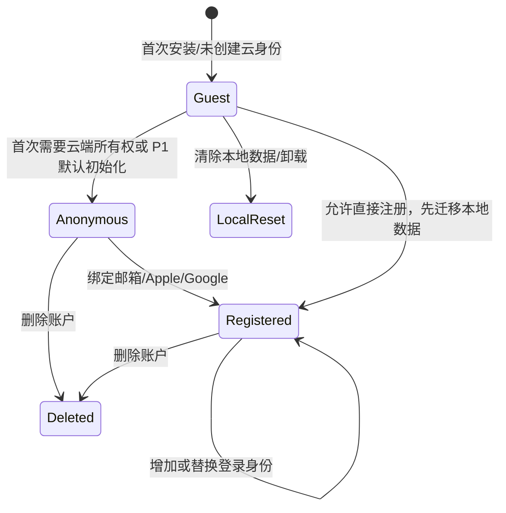

# 05 — Auth and Identity

> AI Kitchen 身份、会话、数据所有权与账号生命周期基线。本文定义 guest、anonymous、registered 三类身份的边界，Supabase Auth 的使用方式，客户端会话存储，云端所有权，游客升级，账号切换，账户删除，RLS 配合，滥用防护和测试门禁。

| 属性 | 内容 |
|---|---|
| 文档版本 | 1.0.0 |
| 状态 | Draft / Ready for Review |
| 身份服务 | Supabase Auth |
| 适用阶段 | P0–P2 |
| 最后更新 | 2026-07-27 |
| 实施状态 | 尚未创建 Auth 配置或身份迁移代码 |

---

## 1. 文档目标

本设计必须同时满足四个看似冲突的目标：

1. 用户第一次打开 App 时，不因强制注册而中断核心体验；
2. 任何云端数据都必须有可验证的所有者，不能相信客户端提交的 `ownerId`；
3. 游客升级为匿名或正式账号时，尽可能不丢失本地历史、收藏和偏好；
4. 身份体系不能成为密钥泄漏、越权访问、重复计费或账号串数据的来源。

本文描述的是目标设计，而不是已完成实现。只有 Auth 环境、RLS、客户端会话、迁移流程和自动化测试全部通过后，对应能力才能标记为 `IMPLEMENTED`。

---

## 2. 上游约束

本文继承以下已接受决策：

- `D-003`：App 不直接调用 AI Provider；
- `D-005`：PostgreSQL + RLS 是主数据系统；
- `D-010`：身份路径为 guest → anonymous → registered；
- `D-012`：development、staging、production 完全隔离；
- `D-013`：requestId + idempotencyKey 全链路使用；
- `04_API_CONTRACT.md`：所有权由受验证 subject 决定；
- `03_DATABASE_DESIGN.md`：云端用户数据统一使用 `owner_id = auth.users.id`。

身份模块不得：

- 接收客户端传入的 `ownerId` 并据此授权；
- 使用设备序列号、广告 ID、IP 或明文邮箱作为唯一身份；
- 把 Supabase Service Role Key 放进 App；
- 在日志中记录 Access Token、Refresh Token 或完整 Authorization Header；
- 将 guest 本地 ID 直接当成云端永久用户 ID；
- 在账号切换后继续展示上一账号的私有缓存；
- 通过关闭 RLS 解决开发阶段权限问题；
- 在账户删除完成后保留可被普通业务重新关联的用户数据。

---

## 3. 身份模型总览



### 3.1 三类身份不是三个完全独立账号系统

它们代表产品生命周期中的不同可信程度和数据能力：

| 类型 | 是否有 `auth.users.id` | 默认数据位置 | 云端持久数据 | 跨设备 | 典型阶段 |
|---|---:|---|---:|---:|---|
| guest | 否 | 本地 | 仅短期请求元数据 | 否 | P0 |
| anonymous | 是 | 本地 + 云端 | 是 | 默认否 | P1 |
| registered | 是 | 本地 + 云端 | 是 | 是 | P2 |

核心原则：

- guest 用于降低首次体验门槛；
- anonymous 用于建立真实云端所有权，而不要求用户立即提供邮箱；
- registered 用于跨设备登录、账户恢复和商店发布所需的正式账号能力；
- anonymous 升级 registered 时优先保持同一 `auth.users.id`，避免所有业务表迁移。

---

## 4. 为什么不一开始强制注册

强制注册会在用户尚未感受到价值前索取邮箱、验证码或第三方授权，显著增加首次生成流失。AI Kitchen 的首要价值是“快速用现有食材得到可执行菜谱”，因此首次体验不应被账号表单阻断。

但完全不创建服务端身份也会带来：

- 无法可靠执行用户级限流；
- 无法建立云端历史和收藏所有权；
- 网络重试后的请求恢复困难；
- 反馈和成本无法关联到稳定 subject；
- 客户端可随意伪造本地 ID。

因此采用分阶段策略，而不是在“强制注册”和“永远无身份”之间二选一。

---

## 5. Guest 身份

### 5.1 Guest 的定义

Guest 是尚未创建 Supabase Auth 用户的本地使用状态。Guest 可以：

- 浏览本地 UI；
- 选择食材和设置生成条件；
- 使用固定假数据流程；
- 在 P0 允许的情况下发起有限次数真实生成；
- 查看本地缓存的最近菜谱；
- 决定稍后升级为 anonymous 或 registered。

Guest 默认不能：

- 创建长期云端历史；
- 跨设备同步；
- 恢复卸载后数据；
- 使用需要正式账户的账户删除、订阅或家庭共享能力；
- 访问任何其他 subject 的请求状态。

### 5.2 本地 Guest ID

App 首次启动生成随机 UUID：

```ts
interface LocalGuestIdentity {
  localGuestId: string;        // UUID v4，仅本地命名空间
  createdAt: string;
  installationId: string;      // 随机值，不使用硬件标识
  migrationVersion: number;
}
```

用途：

- 本地数据命名空间；
- guest → auth 数据迁移批次；
- 排查本地状态，不作为服务端可信身份。

禁止：

- 直接放入 `owner_id`；
- 作为 Bearer Token；
- 上传后让服务端仅凭该值授权；
- 用 MAC、IMEI、Android ID 或广告 ID 替代。

### 5.3 Guest 云端会话

P0 若允许未创建 Supabase anonymous 用户就调用真实生成接口，服务端必须签发短期、不可伪造的 guest session。推荐流程：

```text
App 首次真实生成
  → POST /v1/sessions/guest
  → 服务端签发短期 opaque token
  → Token 内部绑定随机 subject、环境、过期时间和版本
  → App 使用 Authorization: Guest <token>
  → API 解析为 guest subject
```

Guest Token 必须：

- 由服务端签名或保存为不可预测的 opaque session；
- 有明确过期时间，建议 24 小时到 7 天；
- 可轮换、可撤销；
- 不包含原始设备标识；
- 只在对应环境有效；
- 不允许转化为数据库 `auth.uid()`。

数据库仅保存不可逆 `guest_subject_hash`，用于幂等、限流和请求恢复。不得保存明文 guest token。

### 5.4 为什么 Guest 不直接成为永久云端用户

因为 guest token 缺少 Supabase Auth 的会话轮换、身份绑定、RLS 原生支持和账号恢复能力。它只用于 P0 过渡和短期请求，不应成为第二套长期账号系统。

P1 起，首次需要云端持久数据时应静默创建 Supabase anonymous 用户。

---

## 6. Anonymous 身份

### 6.1 定义

Anonymous 是 Supabase Auth 中没有正式登录凭据、但已经拥有 `auth.users.id` 的用户。它是 P1 默认云端身份。

创建后：

- API subject 为 `auth`；
- `owner_id = auth.uid()`；
- RLS 与 registered 使用同一逻辑；
- 历史、收藏、偏好和反馈可以云端保存；
- 后续可绑定正式登录方式而不迁移业务表。

### 6.2 创建时机

推荐采用“延迟但确定”的创建策略：

- P0：可继续 guest；
- P1：用户首次执行需要云端持久化的动作前创建 anonymous；
- 若云端生成本身需要长期历史，则生成前创建；
- 创建失败时，不得伪装成已同步，可退回本地或明确提示。

不建议每次 App 冷启动都创建新 anonymous 用户。必须先恢复已有安全会话。

### 6.3 Anonymous 会话丢失风险

匿名账号没有用户记得的登录凭据。一旦：

- 卸载 App；
- 清除应用数据；
- SecureStore 损坏；
- 用户在另一设备安装；

则匿名云数据可能无法恢复。因此产品必须明确：

- 匿名状态不是跨设备账号；
- 重要数据建议绑定正式账号；
- 账号升级入口应在用户产生收藏或历史后可见；
- 不得向用户承诺匿名数据永久可恢复。

---

## 7. Registered 身份

### 7.1 首版登录方式

P2 推荐优先顺序：

1. 邮箱 Magic Link 或一次性验证码；
2. Apple Sign In（iOS 上架需要评估同类登录要求）；
3. Google Sign In；
4. 密码登录仅在确有需求时增加。

选择原则：

- 尽量减少密码存储和找回流程；
- 依赖 Supabase Auth 处理凭据；
- App 不保存第三方 OAuth Client Secret；
- 回调 URL 按环境隔离；
- 登录方式变化必须更新隐私说明和商店申报。

### 7.2 Anonymous 升级 Registered

首选是“身份绑定”，而不是创建新用户再搬表：

```text
anonymous auth user
  → 用户验证邮箱/Apple/Google
  → 将 identity 绑定到同一 auth user
  → auth.users.id 不变
  → owner_id 无需迁移
```

验收标准：

- 升级前后 `auth.uid()` 相同；
- 历史、收藏、偏好数量一致；
- 幂等请求仍可查询；
- 本地缓存命名空间稳定；
- 旧匿名 Refresh Token 按供应商规则轮换；
- 重复绑定返回稳定错误，不产生第二账号。

### 7.3 Guest 直接注册

Guest 可以跳过 anonymous 直接注册，但流程仍应：

1. 完成正式登录；
2. 获得 `auth.uid()`；
3. 上传本地 guest 数据；
4. 校验迁移数量和哈希；
5. 标记迁移完成；
6. 保留短期本地回滚快照；
7. 清理旧 guest token。

---

## 8. Subject 模型

API 内部统一使用：

```ts
type Subject =
  | {
      type: "guest";
      guestSubjectHash: string;
      environment: "development" | "staging" | "production";
      expiresAt: string;
    }
  | {
      type: "anonymous";
      ownerId: string;
      authUserId: string;
      sessionId?: string;
    }
  | {
      type: "registered";
      ownerId: string;
      authUserId: string;
      assuranceLevel: "aal1" | "aal2";
      identities: string[];
    };
```

### 8.1 Subject 的建立

Subject 只能来自：

- 验证通过的 guest session；
- 验证通过的 Supabase JWT；
- 受控服务端任务的 system/service subject。

Subject 不能来自：

- Request Body 中的 `ownerId`；
- Query 参数中的 user ID；
- 客户端自定义 `X-User-Id`；
- 设备 ID；
- IP 地址；
- 未验证的 JWT payload。

### 8.2 所有权映射

| Subject | 云端长期业务表 | 短期生成请求 |
|---|---|---|
| guest | 默认不写 `owner_id` 数据 | `guest_subject_hash` |
| anonymous | `owner_id = auth.uid()` | `owner_id = auth.uid()` |
| registered | `owner_id = auth.uid()` | `owner_id = auth.uid()` |

表设计不得同时允许 `owner_id` 和 `guest_subject_hash` 都为空。需要二选一约束。

---

## 9. Token 与客户端安全存储

### 9.1 Token 分类

| Token | 保存位置 | 是否可记录日志 | 用途 |
|---|---|---:|---|
| Access Token | SecureStore/受保护会话层 | 否 | API 鉴权 |
| Refresh Token | SecureStore | 否 | 刷新会话 |
| Guest Session Token | SecureStore | 否 | P0 短期 guest API |
| OAuth Authorization Code | 内存/系统回调 | 否 | 交换正式会话 |
| Service Role Key | 仅服务端 Secret | 绝对禁止 | 后端管理操作 |
| AI Provider Key | 仅服务端 Secret | 绝对禁止 | 模型调用 |

### 9.2 Expo 存储策略

- 使用 `expo-secure-store` 或 Supabase 官方支持的安全适配器保存会话；
- AsyncStorage 只保存非敏感 UI 状态和缓存索引；
- 不把 Token 放入 Redux/Zustand 持久化快照；
- 崩溃报告、网络日志和调试面板必须过滤 Authorization；
- production 禁止显示完整 JWT；
- 登出时清理 SecureStore、内存会话和账号私有缓存。

### 9.3 Token 刷新

- 客户端采用单飞刷新，避免多个请求同时刷新；
- 刷新失败区分网络暂时失败与会话失效；
- 401 不得无限刷新重试；
- Token 轮换后立即更新安全存储；
- 旧 Refresh Token 重用异常应触发会话撤销和安全日志；
- App 从后台恢复时先检查会话状态，再执行私有数据同步。

---

## 10. RLS 与应用授权

### 10.1 双层授权

授权必须同时存在：

1. API 应用层：检查当前 subject 是否可执行该动作；
2. 数据库 RLS：限制只能访问 `owner_id = auth.uid()` 的行。

应用层检查提供清晰错误和业务权限；RLS 是最终防线。任何一层都不能替代另一层。

### 10.2 基本 Policy 示例

```sql
alter table public.recipes enable row level security;

create policy "select_own_recipes"
on public.recipes
for select
to authenticated
using (owner_id = auth.uid());

create policy "insert_own_recipes"
on public.recipes
for insert
to authenticated
with check (owner_id = auth.uid());

create policy "update_own_recipes"
on public.recipes
for update
to authenticated
using (owner_id = auth.uid())
with check (owner_id = auth.uid());
```

但 AI 生成保存通常应由受控服务端事务执行。即使使用 Service Role 绕过 RLS，服务端也必须从已验证 subject 显式写入 owner，并进行 A/B 越权集成测试。

### 10.3 禁止的实现

```ts
// 错误：信任客户端 ownerId
await db.from("recipes").insert({
  owner_id: body.ownerId,
  ...recipe,
});
```

正确逻辑：

```ts
const subject = await requireAuthSubject(request);
await recipeService.save({
  ownerId: subject.ownerId,
  recipe,
});
```

---

## 11. Guest → Auth 数据迁移

### 11.1 迁移对象

首版可能迁移：

- 本地历史菜谱快照；
- 收藏关系；
- 用户偏好；
- 生成条件草稿（通常不必云端）；
- 反馈草稿（可选）；
- 烹饪进度默认不跨账号迁移，需产品确认。

### 11.2 迁移批次

```ts
interface GuestMigrationBatch {
  migrationId: string;
  localGuestId: string;
  targetOwnerId: string;
  schemaVersion: "guest-migration.v1";
  itemCounts: {
    recipes: number;
    favorites: number;
    preferences: number;
  };
  contentHash: string;
  createdAt: string;
}
```

服务端唯一约束建议：

```text
(target_owner_id, migration_id)
```

同一迁移重复提交必须重放原结果，不能重复插入。

### 11.3 冲突规则

- 菜谱：按稳定本地 ID 或 snapshot hash 去重；
- 收藏：同一 owner + recipe 唯一；
- 偏好：明确选择“本地覆盖”“云端覆盖”或逐字段时间戳，不得静默随机合并；
- 已删除记录：默认不从旧本地快照复活；
- Schema 过旧：先本地升级或服务端拒绝并返回可处理错误。

### 11.4 迁移完成条件

只有同时满足以下条件，客户端才能清理迁移快照：

- 服务端返回完成；
- 返回数量与本地提交数量一致，或列出明确跳过原因；
- 随机抽查记录可读取；
- 收藏引用有效；
- `CURRENT_STATUS` 和测试记录标记通过。

建议保留 7–30 天本地加密回滚快照，具体时长在隐私数据地图确定。

---

## 12. 登录、登出与账号切换

### 12.1 登录

登录成功后：

1. 验证回调 state/nonce；
2. 保存新会话；
3. 确定 `auth.uid()`；
4. 切换到该 owner 的缓存命名空间；
5. 拉取 profile/preferences；
6. 执行待迁移数据；
7. 恢复同步；
8. 记录不含 PII 的 auth 事件。

### 12.2 登出

登出必须：

- 调用 Auth signOut；
- 清理 Access/Refresh Token；
- 取消私有 API 请求；
- 清理内存状态；
- 卸载当前账号查询缓存；
- 清理或加密隔离私有本地数据；
- 回到 guest 或新 anonymous 的明确状态；
- 不删除云端数据，除非用户选择账户删除。

### 12.3 账号切换

本地存储必须按 owner 命名空间：

```text
public:*                     非敏感共享参考数据
guest:<localGuestId>:*       本地游客数据
user:<authUserId>:*          私有账号数据
```

禁止使用全局 `recentRecipes` 键保存所有账号数据。账号 B 登录后，任何账号 A 的菜谱、偏好、反馈和烹饪进度都不得短暂闪现。

---

## 13. 账户删除

### 13.1 产品与合规目标

Registered 用户必须能在 App 内发起账户删除。删除不是“退出登录”，也不是只删除 profile。

删除范围至少包括：

- profile；
- preferences 和过敏设置；
- 用户拥有的菜谱和步骤/食材关系；
- favorites；
- feedback 中可删除的用户关联；
- guest migration 记录；
- 可识别的 generation request 关联；
- Auth identity 和 session；
- 其他隐私数据地图列出的对象。

### 13.2 删除编排

```text
用户二次确认
  → 必要时重新认证
  → 创建 deletion_request
  → 冻结新的持久写入
  → 删除/匿名化业务数据
  → 验证引用和保留例外
  → 删除 Auth 用户
  → 撤销会话
  → 客户端清理本地数据
  → 返回完成状态
```

### 13.3 保留例外

因安全、财务、反滥用或法律要求保留的数据必须：

- 有明确目的和期限；
- 尽可能去标识化；
- 与可登录账号断开普通业务关联；
- 限制访问；
- 在隐私政策和 `12_PRIVACY_DATA_MAP.md` 中一致披露。

不能使用“可能以后有用”作为无限期保留理由。

---

## 14. 重新认证与高风险操作

以下操作建议要求近期认证或更高保证等级：

- 账户删除；
- 变更主要邮箱；
- 绑定/解绑唯一登录方式；
- 导出用户数据；
- 管理未来订阅和付款；
- 查看高敏感后台信息（若未来存在）。

高风险操作不得只依赖“当前 App 仍打开”。服务端应检查会话签发时间、AAL 或执行重新认证挑战。

---

## 15. 限流与滥用防护中的身份

限流键优先级：

1. registered/anonymous `auth.uid()`；
2. guest subject hash；
3. IP、安装随机 ID 和设备风险信号作为辅助；
4. 全局模型预算与熔断。

禁止只按 IP 限流，因为：

- 家庭、学校或公司可能共享 IP；
- 移动网络 IP 变化；
- VPN/NAT 容易误伤；
- 无法防止同一账号多 IP 滥用。

同时禁止只信任安装 ID，因为它可以被重置或伪造。

---

## 16. 隐私与日志

可记录：

- subject 类型；
- 哈希化或内部 owner 引用；
- Auth 事件类型；
- 成功/失败代码；
- requestId；
- provider 名称（不含密钥）；
- 时间、环境和客户端版本。

禁止记录：

- 完整 JWT；
- Refresh Token；
- Authorization Header；
- OAuth code；
- 密码；
- Magic Link 完整 URL；
- 未脱敏邮箱；
- 第三方身份完整原始 payload；
- 与问题无关的过敏或健康信息。

日志中的 owner 标识应限制访问，不应暴露给普通客户端。

---

## 17. 错误模型

身份错误必须映射到 API 稳定错误码：

| HTTP | 错误码 | 场景 | 客户端处理 |
|---:|---|---|---|
| 401 | `AUTH_REQUIRED` | 端点需要 Auth | 引导创建/恢复身份 |
| 401 | `SESSION_EXPIRED` | 会话已失效 | 尝试一次刷新，失败后登录 |
| 401 | `INVALID_GUEST_SESSION` | guest token 无效 | 重新签发，不重复生成 |
| 403 | `REGISTERED_ACCOUNT_REQUIRED` | 需要正式账号 | 展示升级说明 |
| 403 | `REAUTHENTICATION_REQUIRED` | 高风险操作 | 发起重新认证 |
| 409 | `IDENTITY_ALREADY_LINKED` | 第三方身份已绑定 | 引导账号恢复/支持 |
| 409 | `MIGRATION_ALREADY_COMPLETED` | 重复迁移 | 返回原结果 |
| 409 | `ACCOUNT_DELETION_IN_PROGRESS` | 删除中 | 阻止新写入，显示状态 |
| 422 | `GUEST_MIGRATION_INVALID` | 数据包不合法 | 保留本地快照并提示 |

不要将所有身份错误都显示为“登录失败”。

---

## 18. 客户端状态机

```ts
type AuthState =
  | { status: "booting" }
  | { status: "guest"; localGuestId: string; guestSession?: GuestSession }
  | { status: "anonymous"; userId: string; session: Session }
  | { status: "registered"; userId: string; session: Session }
  | { status: "refreshing"; previous: "anonymous" | "registered" }
  | { status: "migrating"; userId: string; migrationId: string }
  | { status: "deleting"; deletionRequestId: string }
  | { status: "error"; recoverable: boolean; code: string };
```

UI 不得在 `booting` 时先渲染上一账号私有数据。路由权限应基于已恢复的 AuthState，而不是是否存在某个 AsyncStorage 字段。

---

## 19. 服务端模块边界

推荐结构：

```text
supabase/functions/_shared/auth/
├── authenticate-request.ts
├── guest-session.ts
├── subject.ts
├── authorization.ts
├── reauthentication.ts
└── auth-errors.ts

packages/domain/identity/
├── identity-policy.ts
├── guest-migration.ts
├── account-deletion.ts
└── identity-events.ts
```

职责：

- `authenticate-request`：验证 guest 或 Supabase Token；
- `subject`：建立统一 subject；
- `authorization`：端点级权限；
- `guest-migration`：幂等迁移；
- `account-deletion`：删除编排；
- `identity-events`：脱敏审计。

Auth 模块不得包含菜谱生成 Prompt，也不得直接实现 UI。

---

## 20. 测试策略

### 20.1 单元测试

- subject 解析；
- guest token 签发、过期和撤销；
- 权限矩阵；
- Token 日志脱敏；
- 账号缓存命名空间；
- guest 迁移冲突规则；
- 删除状态机。

### 20.2 集成测试

必须至少覆盖：

1. 用户 A 不能读取用户 B 菜谱；
2. 用户 A 修改 Body 中 ownerId 仍不能写入 B；
3. anonymous 升级后 auth UID 不变；
4. 重复 guest migration 不重复插入；
5. 账号切换后本地缓存不串数据；
6. Refresh Token 失效后不能继续调用私有 API；
7. guest token 过期后不能读取原 subject 的请求；
8. deletion 进行中不能创建新长期数据；
9. 删除完成后旧 Token 全部失效；
10. Service Role 路径仍显式写入正确 owner。

### 20.3 RLS 自动化

对每张用户表执行 A/B/C 三类测试：

- A：拥有者，应允许规定操作；
- B：其他已登录用户，应拒绝；
- C：未登录/guest，应拒绝长期私有数据。

任何新增用户表没有 RLS 测试，不得进入 staging。

### 20.4 真机测试

- Android 首次启动 guest；
- anonymous 创建和重启恢复；
- 网络断开时登录行为；
- 邮箱/第三方登录回调；
- 卸载后匿名不可恢复提示；
- 账号切换无旧数据闪现；
- 删除账户后重新启动状态正确。

---

## 21. 安全威胁与控制

| 威胁 | 控制 |
|---|---|
| 伪造 ownerId | subject + RLS，不读取客户端 ownerId |
| Token 泄漏到日志 | 网络/崩溃/服务端日志统一脱敏 |
| Refresh Token 重放 | 供应商轮换、异常撤销、单飞刷新 |
| Guest ID 伪造 | 服务端签发 guest session，不信任本地 UUID |
| 账号串缓存 | owner 命名空间 + 登出清理 + UI boot gate |
| Anonymous 数据丢失 | 升级提示、同 UID 绑定、清晰产品说明 |
| OAuth 回调劫持 | PKCE、state、nonce、受控 deep link |
| Service Role 滥用 | 只在后端 Secret，最小代码路径和审计 |
| 删除不完整 | 删除编排、引用校验、隐私数据地图 |
| 越权 API | 端点授权 + RLS + A/B 集成测试 |

---

## 22. 实施顺序

### 阶段 A：P0

- 本地 guest identity；
- guest session（若真实生成在 anonymous 前开放）；
- guest 级限流和幂等；
- Token 日志脱敏；
- 不建立长期 guest 云数据。

### 阶段 B：P1

- Supabase anonymous Auth；
- Auth subject；
- owner_id + RLS；
- 云端历史、收藏和偏好；
- guest → anonymous 迁移；
- 账号私有缓存命名空间。

### 阶段 C：P2

- 邮箱/Apple/Google；
- anonymous → registered 同 UID 升级；
- 重新认证；
- 账户删除；
- 数据导出/支持流程；
- 合规和商店审核验证。

---

## 23. Definition of Done

身份模块只有满足以下条件才能标记完成：

- [ ] 三类身份和权限矩阵已实现；
- [ ] 客户端不提交 ownerId 决定所有权；
- [ ] 所有用户表启用 RLS；
- [ ] A/B 越权测试通过；
- [ ] Token 不出现在日志、崩溃报告或持久状态；
- [ ] anonymous 升级保持同一 UID；
- [ ] guest 迁移可重试且幂等；
- [ ] 登出和账号切换不串数据；
- [ ] 账户删除端到端可验证；
- [ ] development/staging/production Auth 配置隔离；
- [ ] 错误码与 `04_API_CONTRACT.md` 一致；
- [ ] `CHANGELOG.md`、`CURRENT_STATUS.md` 和隐私数据地图已更新。

---

## 24. 待实施时确认的配置项

以下不是架构开放项，而是实施前需要填写的环境配置：

- guest session 有效期；
- anonymous 创建的确切触发点；
- 首批登录方式和地区；
- OAuth 回调 URL；
- Magic Link/OTP 有效期和频率；
- SecureStore 适配器；
- 账户删除冷静期；
- guest migration 本地快照保留天数；
- 日志 owner hash 的密钥轮换策略；
- 支持邮箱和账号恢复流程。

这些参数确认后，应记录在环境配置文档，不得散落于客户端代码。

---

## 25. 结论

AI Kitchen 的身份系统不是一个“登录页面”，而是数据所有权、RLS、同步、限流、成本、隐私和账户删除的共同基础。首版通过 guest 降低门槛，通过 anonymous 建立可靠云端所有权，通过 registered 提供跨设备和恢复能力。任何为了快速开发而信任客户端 user ID、关闭 RLS、共享缓存或复制账号数据的实现，都会破坏整个工程基线。
