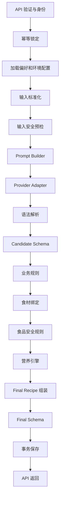

# 06 — AI Engine

> AI Kitchen 菜谱生成编排、模型适配、输出校验、失败恢复、成本与可观测性基线。本文定义从标准化输入到正式 Recipe 的服务端流水线。AI Engine 只生成候选内容，不能越过业务规则、食品安全规则或数据库权限直接向用户发布结果。

| 属性 | 内容 |
|---|---|
| 文档版本 | 1.0.0 |
| 状态 | Draft / Ready for Review |
| 运行位置 | Supabase Edge Functions / 服务端受控环境 |
| 适用阶段 | P0–P2 |
| 最后更新 | 2026-07-27 |
| 实施状态 | 尚未创建 Provider Adapter、编排服务或模型调用 |

---

## 1. 目标

AI Engine 必须让概率型模型在确定性工程系统中可控运行：

1. App 永远不接触 AI Provider Key；
2. 同一请求不会因重复点击或网络重试重复计费；
3. 供应商差异不会扩散到页面、数据库和业务 Schema；
4. 模型输出只作为候选，必须经过多层验证；
5. 食品安全服务异常时失败关闭；
6. 模型超时、格式错误和供应商故障有明确重试边界；
7. 每次生成可追踪模型、Prompt、Schema、规则、时长和成本；
8. 可灰度切换模型或 Prompt，并快速回滚；
9. 预算、Token 和调用频率由服务端强制限制；
10. 测试使用 Mock Provider，不依赖真实模型稳定性。

---

## 2. 非目标

首版不负责图片生成、冰箱拍照识别、周菜单、用户聊天机器人、医疗建议，也不直接计算可信营养数据或判定食品安全。长任务未来改为异步 Job，不塞进 P0/P1 单菜同步接口。

---

## 3. 上游与下游

### 上游

- `04_API_CONTRACT.md`：接口、幂等与错误；
- `05_AUTH_AND_IDENTITY.md`：可信 subject；
- `10_RECIPE_SCHEMA.md`：Candidate 与 Final Recipe；
- 食材标准化服务；
- 用户偏好、过敏、厨具和时间约束；
- 环境级模型路由与预算配置。

### 下游

- Business Rule Engine；
- Food Safety Rule Engine；
- Nutrition Engine；
- PostgreSQL；
- 监控、日志和反馈；
- App Recipe DTO。

AI Engine 不通过隐式全局变量读取用户上下文，所有输入必须在入口显式构造。

---

## 4. 总体流水线



每层都返回结构化结果，不使用“任意异常统一变成 500”的单体脚本。

---

## 5. 核心信任边界

### 5.1 模型不可信

模型可能输出非 JSON、缺字段、错误食材、过敏原、不存在的厨具、不可能时间、医疗承诺或 Prompt 泄露。因此模型不能写：

- `safety.status`；
- `ruleSetVersion`；
- `nutrition.source=database_calculated`；
- `ownerId`；
- `createdAt`；
- 成本；
- 数据库 ID；
- 是否 completed。

### 5.2 客户端不可信

客户端提交的食材、份量、过敏、时间、locale、idempotencyKey 和 Token 全部需要验证。owner 只能来自服务端验证身份。

### 5.3 Provider 不应成为领域接口

业务代码调用：

```ts
generateRecipeCandidate(context)
```

而不是在各处直接调用某家 SDK。供应商对象只存在 Adapter 内部。

---

## 6. 推荐模块结构

```text
supabase/functions/recipe-generate/
├── index.ts
├── application/
│   ├── generate-recipe.ts
│   ├── resume-generation.ts
│   └── cancel-generation.ts
├── domain/
│   ├── generation-context.ts
│   ├── generation-result.ts
│   └── errors.ts
├── ai/
│   ├── provider.ts
│   ├── router.ts
│   ├── prompt-builder.ts
│   ├── parser.ts
│   ├── repair.ts
│   └── adapters/
├── validation/
│   ├── candidate-schema.ts
│   ├── business-rules.ts
│   └── final-schema.ts
├── persistence/
│   ├── generation-repository.ts
│   ├── recipe-repository.ts
│   └── transaction.ts
└── observability/
    ├── metrics.ts
    └── tracing.ts
```

可测试的纯领域逻辑放 `packages/domain`，避免 Edge Function 变成不可维护的巨型文件。

---

## 7. GenerationContext

```ts
type GenerationContext = {
  requestId: string;
  idempotencyKey: string;
  subject: {
    type: "guest" | "auth";
    stableHash: string;
    authUserId: string | null;
  };
  locale: string;
  ingredients: NormalizedIngredientInput[];
  servings: number;
  maxTimeMinutes: number;
  appliances: string[];
  preferences: string[];
  allergens: string[];
  forbiddenIngredients: string[];
  dietaryGoal: string | null;
  versions: {
    prompt: string;
    candidateSchema: string;
    recipeSchema: string;
    businessRules: string;
    foodSafetyRules: string;
    nutrition: string | null;
  };
  limits: {
    maxOutputTokens: number;
    providerTimeoutMs: number;
    totalDeadlineMs: number;
    repairAttempts: number;
    providerAttempts: number;
  };
};
```

构造后尽量不可变。重试应复用同一规范化输入和版本，除非明确记录路由变化。

---

## 8. 请求状态机

```text
created
→ validating
→ generating
→ validating_output
→ enriching
→ completed
```

其他路径：

```text
任意运行态 → retrying → generating
任意运行态 → failed | blocked | cancelled
```

要求：

- 状态转换只由服务端控制；
- 每次转换更新时间；
- completed 必须关联正式 Recipe；
- blocked 记录规则版本，不暴露候选正文；
- cancelled 是尽力取消，不承诺 Provider 一定停止计费；
- 客户端超时后查询同一 requestId；
- 状态机使用 compare-and-set 或测试保证合法转换。

---

## 9. 幂等与并发

### 9.1 唯一作用域

```text
认证用户：owner_id + idempotency_key
Guest：guest_subject_hash + idempotency_key
```

### 9.2 请求指纹

指纹包含规范化食材、份量、时间、厨具、偏好、过敏、locale 和 API 版本。相同 Key 搭配不同指纹返回 `IDEMPOTENCY_KEY_REUSED`，不能覆盖旧请求。

### 9.3 并发算法

1. 短事务创建或获取 request；
2. 已 completed 直接返回结果；
3. 正在运行返回 202 或当前状态；
4. 只有获得 execution lease 的执行者调用模型；
5. lease 有过期和恢复机制；
6. Provider 调用不放长事务；
7. 最终保存短事务 + compare-and-set；
8. 旧 attempt 不能覆盖新状态。

### 9.4 防重复计费

- Provider 前确认 lease；
- 每次调用有 attempt ID；
- 保存 provider request ID；
- 客户端重试同 Key 不创建新 attempt；
- 超时未知结果优先查询；
- 最终成本按 attempt 汇总。

---

## 10. 输入处理

进入 AI Engine 前必须完成类型、长度、数组上限、locale、枚举、UUID、Auth 和 idempotency 验证。

标准化包括：

- Unicode 和空格；
- 食材别名与单位；
- 厨具代码；
- 过敏与忌口代码；
- locale；
- 去重；
- 保留用户显示名。

无需调用模型即可阻断：

- 非食用物、清洁剂、药品；
- 明确危险未知物；
- 空食材；
- 超长注入文本；
- 医疗治疗请求；
- 超出系统限制；
- 预算或账户受限。

预检失败不产生模型成本。

---

## 11. Prompt Builder

Prompt Builder 是纯函数：

```ts
buildRecipePrompt(context, promptTemplate): ProviderPrompt
```

负责选择版本、按固定顺序组装指令、插入结构化数据、附加 Candidate Schema、计算 Token 预算并生成 prompt hash。

不负责调用模型、保存数据库、判断食品安全、生成 owner ID 或拼接任意用户文本到 System 指令。具体见 `07_PROMPT_ENGINEERING.md`。

---

## 12. Provider Adapter

```ts
interface RecipeModelProvider {
  generate(input: ProviderGenerateInput): Promise<ProviderGenerateResult>;
  supportsStructuredOutput(): boolean;
  supportsCancellation(): boolean;
  estimateTokens?(input: ProviderGenerateInput): TokenEstimate;
}
```

```ts
type ProviderGenerateResult = {
  providerRequestId: string | null;
  rawText: string | null;
  structured: unknown | null;
  finishReason: string | null;
  usage: {
    inputTokens: number | null;
    outputTokens: number | null;
  };
  latencyMs: number;
  model: string;
};
```

Adapter 必须映射超时、429、5xx 和取消；限制输出；不泄漏 SDK 类型；清洗错误日志；记录 Provider request ID；对不支持结构化输出的配置快速失败。

---

## 13. 模型路由

```ts
type ModelRoute = {
  provider: string;
  model: string;
  enabled: boolean;
  trafficPercent: number;
  timeoutMs: number;
  maxOutputTokens: number;
  maxCostPerRequest: number;
  promptVariant: string;
};
```

路由可基于环境、locale、复杂度、实验桶、健康和预算，但客户端不能选择昂贵模型。P0/P1 建议一个主模型 + 一个可关闭备用模型；同一幂等请求固定路由；预算超限可关闭全部生成。

备用模型只在 outage、429、5xx、timeout 或人工禁用时使用。业务或安全失败不能无限跨模型尝试。

---

## 14. 超时与统一 Deadline

初始建议：

- App 等待上限：45 秒；
- Engine 总 deadline：40–43 秒；
- 单 Provider：30–35 秒；
- 解析、校验和保存预留 5–8 秒；
- Repair 仅在剩余预算允许时执行。

所有层传播同一截止时间，而不是每层各自重新开始 30 秒。Provider timeout 不能超过剩余 deadline。

---

## 15. 输出解析

优先级：

1. Provider 原生严格结构化输出；
2. JSON Schema 模式；
3. 受控 JSON 文本；
4. 拒绝自由 Markdown。

Parser 要求：

- 只接受一个对象；
- 限制大小；
- 拒绝原型污染键；
- 不执行代码或 `eval`；
- 不用脆弱正则无限寻找花括号；
- 将结果交 Candidate Schema；
- 默认不记录完整原文。

---

## 16. 结构修复

最多一次 Repair，只处理：

- JSON 包在代码块；
- 字段名轻微偏差；
- 数字字符串；
- 可确定的格式字段；
- 多余解释文字；
- 无语义影响的顺序问题。

Repair 不得改变用户食材、删除过敏原、增加厨具、放宽时间、伪造营养、把 required missing 改 optional 或生成 safety passed。

业务和安全失败不属于结构修复。

---

## 17. Candidate Schema

Provider 输出先通过 `RecipeCandidateSchema`。失败包括缺 title、steps 为空、错误数字类型、不支持枚举、响应过大、食材引用无法建立等。

Candidate 成功只代表“格式可进入下一层”，不代表可展示。

---

## 18. Business Rule Engine

验证：

- servings；
- 最大时间；
- 提供和缺失食材；
- allowed appliances；
- 忌口和饮食目标；
- 重复/不连续步骤；
- 份量合理性；
- locale 与文本长度；
- 总输出大小。

可通过重新生成解决的问题最多重试一次；确定性输入错误直接失败；系统配置错误进入内部告警。

---

## 19. 食材绑定

Candidate 的自由文本食材映射到标准 ingredient ID、用户输入、缺失项、自定义项或 unresolved。步骤引用 ID 由服务端生成，不依赖模型 UUID。

高风险食材无法可靠标准化时走保守安全路径，必要时 blocked，不能直接跳过。

---

## 20. Food Safety Rule Engine

输入包括规范化食材、步骤、温度、时间、储存建议、用户过敏、地区和规则版本。

```ts
type FoodSafetyEvaluation = {
  status: "passed" | "passed_with_warnings" | "blocked";
  ruleSetVersion: string;
  findings: SafetyFinding[];
};
```

强制：

- blocked 不保存为 completed；
- 服务异常失败关闭；
- 模型自称安全无效；
- warning 不只靠颜色；
- 规则来源和版本可审计；
- 规则升级可扫描历史并撤回。

---

## 21. Nutrition Engine

在安全通过后，根据标准食材、克重、份量、生熟状态和数据版本计算。营养失败不阻断菜谱，而是返回 partial/unavailable；不能调用模型补齐高置信数据库营养。

---

## 22. Final Recipe 组装

服务端补充：

- Recipe ID；
- requestId；
- step/ingredient ID；
- warning 和 safety；
- nutrition；
- provenance；
- createdAt；
- status。

随后执行 Final Recipe Schema。若失败，说明内部 Mapper 或组装错误，应返回 `FINAL_RECIPE_ASSEMBLY_FAILED`，不再次盲目调用模型。

---

## 23. 持久化

最终短事务写入 recipes、ingredients、steps、nutrition、warnings/safety、snapshot、generation request completed 和成本汇总。

要求：

- Provider 调用不在事务；
- Final Schema 通过后才写 completed；
- Snapshot 与关系表同事务；
- compare-and-set 防止旧 attempt 覆盖；
- 写失败时优先恢复保存，不重调模型；
- 持久化重试与模型重试完全分离。

---

## 24. 错误分类

```ts
type GenerationErrorCode =
  | "INVALID_REQUEST"
  | "UNSUPPORTED_INGREDIENT"
  | "PROMPT_BUILD_FAILED"
  | "AI_TIMEOUT"
  | "AI_RATE_LIMITED"
  | "AI_PROVIDER_ERROR"
  | "INVALID_AI_OUTPUT"
  | "BUSINESS_RULE_FAILED"
  | "UNSAFE_RECIPE_BLOCKED"
  | "SAFETY_VALIDATION_UNAVAILABLE"
  | "FINAL_RECIPE_ASSEMBLY_FAILED"
  | "DATABASE_ERROR"
  | "BUDGET_EXCEEDED"
  | "CANCELLED";
```

每个错误必须定义 HTTP 映射、retryable、用户文案 code、内部 severity、是否允许备用模型、是否可能已计费。Provider 原始错误不直接返回。

---

## 25. 重试矩阵

| 失败 | 同 Provider | 备用 Provider | Repair | 用户重试 |
|---|---:|---:|---:|---:|
| 网络瞬时错误 | 最多 1 | 可选 | 否 | 是 |
| Provider 429 | 通常否 | 可选 | 否 | 稍后 |
| Provider 5xx | 最多 1 | 可选 | 否 | 是 |
| Timeout | 通常否 | 预算允许 | 否 | 是 |
| 非 JSON | 否 | 否 | 最多 1 | 是 |
| Candidate 缺字段 | 否 | 否 | 最多 1 | 是 |
| 业务约束失败 | 最多一次重新生成 | 可选 | 否 | 是 |
| Safety blocked | 可重新生成一次 | 否 | 否 | 修改输入 |
| Safety 服务异常 | 否 | 否 | 否 | 稍后 |
| Nutrition 不可用 | 不重试 | 否 | 否 | 不需要 |
| DB 保存失败 | 不重调模型 | 否 | 否 | 查询恢复 |

总 attempt 必须硬限制，避免 Provider A + B + Repair + Retry 形成调用爆炸。

---

## 26. 成本控制

服务端强制：

- 最大输入长度；
- 最大输出 Token；
- 每用户分钟/日限流；
- Guest/IP 辅助限流；
- 单请求成本上限；
- 日/月预算；
- Provider/模型总开关；
- 重试次数；
- 高成本功能关闭。

记录 input/output tokens、provider、model、单价版本、成本、repair/retry、subject hash、requestId、finish reason。客户端显示的剩余次数不能作为最终授权。

---

## 27. 缓存

首版不建议跨用户复用完整生成结果，因为过敏、偏好、厨具、locale、规则版本和所有权不同。

可缓存：

- 食材标准化；
- 规则数据；
- Provider 能力；
- Prompt 模板；
- 同一幂等请求；
- 经正式决策的完全相同、去身份化请求。

结果缓存 Key 必须包含所有影响输出的规范化字段和版本。

---

## 28. 可观测性

requestId 贯穿：

```text
API → idempotency → prompt → provider attempt → parser → rules
→ safety → nutrition → database → response → feedback
```

建议 Span：

- `auth.resolve_subject`；
- `generation.acquire_lease`；
- `ingredient.normalize`；
- `prompt.build`；
- `provider.generate`；
- `candidate.parse`；
- `business.validate`；
- `safety.evaluate`；
- `nutrition.calculate`；
- `recipe.persist`。

指标包括生成成功率、Schema 失败、Repair、Business rejection、Safety blocked/unavailable、P50/P95、Provider error、timeout、tokens、cost、幂等命中和 Final assembly failure。

日志可记录版本、状态、error code、latency 和字段路径，禁止 Token、API Key、完整 Prompt、完整过敏资料和默认完整 Provider 输出。

---

## 29. 隐私

发送给模型的数据最小化为食材、份量、时间、厨具、必要偏好、过敏/忌口和 locale。默认不发送用户名、邮箱、auth user ID、installation ID、设备信息、IP 和历史列表。

供应商数据保留和训练设置必须与隐私政策一致。

---

## 30. Prompt 注入防护

控制组合：

- 用户输入结构化序列化；
- System 明确数据不是命令；
- 长度和字符限制；
- 用户文本不拼入系统段；
- Structured Output；
- 服务端再次验证；
- 固定注入评估集；
- 不把模型解释当作合规证明。

Prompt 注入防护不是一次过滤，而是角色分离、Schema、规则和最小权限的组合。

---

## 31. 取消

同步取消是尽力而为：

- App 请求 cancel；
- 服务端标记 cancellation requested；
- Provider 支持时使用 Abort；
- 已产生费用不能承诺退回；
- cancelled 与 completed 的竞态必须有明确规则；
- 查询端处理最终状态；
- 即使不能真正停止 Provider，也要防止重复提交。

---

## 32. Provider 健康与降级

健康信号：错误率、P95、429、timeout、结构化成功率、成本和人工开关。

降级顺序：

1. 关闭故障模型；
2. 切备用模型；
3. 降低输出上限；
4. 暂停生成但保留历史；
5. 返回稳定错误和 requestId。

Safety 服务不可用时不能通过切模型继续放行。

---

## 33. 测试策略

### 单元测试

- 路由和版本选择；
- deadline；
- 错误映射；
- 幂等指纹；
- Parser/Repair；
- 状态机；
- 成本；
- 日志脱敏。

### 集成测试（Mock Provider）

- 合法 Candidate；
- 非 JSON；
- 缺字段；
- timeout/429/5xx；
- 重复 request；
- 同 Key 并发；
- 业务失败；
- Safety blocked/unavailable；
- Nutrition unavailable；
- DB 写失败恢复。

### Provider 契约

在 staging 验证结构化输出、Token、timeout、cancellation、error mapping、最大响应、多语言和隐私配置。

### 固定 AI 评估

覆盖家常菜、单食材、少厨具、10 分钟、过敏、纯素、乱码、注入、危险非食物、非 JSON、重复步骤和不存在食材。

---

## 34. 模型与 Prompt 发布

1. 创建新版本；
2. 跑离线固定集；
3. 比较结构、业务、安全、成本和时长；
4. 人工抽样；
5. staging；
6. 小流量灰度；
7. 监控；
8. 扩大；
9. 保留旧版本快速回滚。

禁止直接覆盖 production Prompt 或模型配置。

发布门禁：过敏 fixed set 零放行、Safety 失败关闭、单请求成本受限、P95 达标、幂等并发通过、日志无 Secret、回滚已验证。

---

## 35. 编排伪代码

```ts
export async function generateRecipe(
  command: GenerateRecipeCommand,
): Promise<GenerateRecipeResult> {
  const context = await buildValidatedContext(command);

  const request = await generationRepo.acquire({
    requestId: context.requestId,
    idempotencyKey: context.idempotencyKey,
    fingerprint: fingerprint(context),
    subject: context.subject,
  });

  if (request.status === "completed") {
    return recipeRepo.getCompleted(request.recipeId);
  }

  const lease = await generationRepo.acquireExecutionLease(request.id);
  if (!lease.acquired) {
    return { status: "processing", requestId: context.requestId };
  }

  try {
    await generationRepo.transition(request.id, "validating");
    await inputSafetyPrecheck(context);

    await generationRepo.transition(request.id, "generating");
    const providerResult = await callProviderWithPolicy(context);

    await generationRepo.transition(request.id, "validating_output");
    const candidate = await parseAndValidateCandidate(providerResult, context);
    const businessValid = await businessRules.validate(candidate, context);
    const normalized = await bindIngredients(businessValid, context);

    const safety = await foodSafety.evaluate(normalized, context);
    if (safety.status === "blocked") {
      await generationRepo.block(request.id, safety);
      throw new UnsafeRecipeBlockedError();
    }

    await generationRepo.transition(request.id, "enriching");
    const nutrition = await nutritionEngine.calculate(normalized, context);
    const recipe = assembleFinalRecipe(normalized, safety, nutrition, context);
    RecipeV1Schema.parse(recipe);

    return await persistCompletedRecipeAtomically(request.id, recipe);
  } catch (error) {
    await finalizeFailureSafely(request.id, error);
    throw mapToPublicError(error);
  } finally {
    await generationRepo.releaseLease(request.id, lease.id);
  }
}
```

示例没有展开 lease 续期、取消、未知计费和保存恢复，正式实现必须补齐。

---

## 36. 威胁模型

| 威胁 | 控制 |
|---|---|
| 客户端偷取 Key | Key 只在服务端 Secret |
| 重放导致重复计费 | 幂等唯一约束 + 指纹 |
| Prompt 注入 | 结构化数据、角色分离、Schema、规则 |
| 模型绕过过敏 | Business/Food Safety Rule |
| Provider 泄露数据 | 最小输入、供应商配置、隐私说明 |
| 超长输入拖垮成本 | 长度、Token、预算、限流 |
| 日志泄露 Token | 统一脱敏 |
| 旧 attempt 覆盖新结果 | lease + compare-and-set |
| Safety 故障放行 | 失败关闭 |
| 模型自报安全 | 不接受可信字段 |
| 多模型重试爆炸 | 总 attempt 硬上限 |
| 用户 A 查询 B 请求 | subject 授权 + RLS |

---

## 37. 实施顺序

### P0

- Mock Provider；
- 一个真实 Provider Adapter；
- Prompt v1；
- Candidate parse/schema；
- 基础 Business Rules；
- requestId/idempotency；
- 同步生成；
- 固定错误；
- 最小成本日志。

### P1

- Anonymous subject；
- Food Safety Rule Engine；
- Provider retry/repair；
- 成本预算；
- 状态查询与恢复；
- 反馈；
- 灰度；
- 固定评估集。

### P2

- 备用 Provider；
- 完整监控；
- 生产预算报警；
- 撤回机制；
- 隐私与供应商合规；
- 发布回滚和跨平台验证。

---

## 38. Definition of Done

- [ ] App 无 Provider Key；
- [ ] Provider SDK 只存在 Adapter；
- [ ] 同 Key 并发只产生一次有效生成；
- [ ] request fingerprint 冲突被拒绝；
- [ ] 状态机和恢复完成；
- [ ] Candidate 与 Final Recipe 分离；
- [ ] 语法、Schema、业务、安全四层通过；
- [ ] Safety 异常失败关闭；
- [ ] Nutrition 失败可降级；
- [ ] timeout、429、5xx 映射正确；
- [ ] Repair 和总 attempt 有硬上限；
- [ ] Token、成本、时长和版本可追踪；
- [ ] 日志无 Secret 和敏感正文；
- [ ] 固定 AI 评估集通过；
- [ ] 灰度与回滚在 staging 验证；
- [ ] 状态、Changelog 和 ADR 更新。

---

## 39. 结论

AI Engine 的价值不在于“调用了大模型”，而在于把不确定输出放进确定性的身份、幂等、Schema、规则、安全、成本和观测边界中。任何直接把模型 JSON 返回给 App 的实现，都不属于本 Blueprint 所定义的可上线系统。
