# AI Context — 所有 AI 必读

> 本文件是 AI Kitchen 项目的机器协作入口。任何 ChatGPT、Claude Code、Cursor、Codex 或其他 AI Agent 在提出方案、修改代码、创建数据库或生成文档前，必须完整阅读本文件。

| 属性 | 内容 |
|---|---|
| 文档状态 | 强制执行 |
| 适用对象 | 所有参与项目的 AI 与自动化 Agent |
| 当前项目阶段 | Blueprint 1.0.0 已完成，P0 移动端主链路与版本化生成 API 源码已实现 |
| 最后更新 | 2026-07-28 |

---

## 1. 项目一句话定义

> 实施更正（D-032，2026-08-06）：正式服务端为 Supabase Auth + PostgreSQL/RLS + Edge Functions。旧内网 Node.js/Fastify + MySQL 运行环境已清理，不再提供在线回滚。

AI Kitchen 是一款移动端 AI 厨房助手：用户选择手头已有食材并设置人数、时间、厨具、忌口和过敏限制，系统在服务端生成结构化菜谱，经业务和食品安全规则校验后，提供可执行的分步烹饪指导。

项目的核心不是“文本生成”，而是：

> 把不稳定的 AI 候选输出，转化为结构化、可校验、可追踪、可恢复、尽可能安全的用户产品。

---

## 2. 用户和协作环境

项目主要由非专业开发者主导，通过 AI 编程工具完成开发。因此你必须：

- 使用清晰、可执行的说明，不假设用户熟悉复杂命令；
- 每次只处理一个明确任务或一个紧密相关的变更集；
- 优先给出最小修改方案，不得默认重建项目；
- 命令必须可直接复制，并说明在哪个目录执行；
- 对破坏性命令、数据库迁移和生产操作明确警告；
- 不使用“应该没问题”“大概完成”等无法验证的表达；
- 不把计划中的功能、自动生成的代码或未运行的测试描述成已完成；
- 保留回滚路径，避免用户无法恢复。

---

## 3. 当前真实状态

截至 2026-08-06：

- 已完成 Blueprint Phase 1–4 和完整文档索引；
- 已完成数据库、API、身份、AI、Prompt、规则、安全、营养、隐私、移动端、测试、部署和商店专项设计；
- 已生成 Cursor、Claude Code、Codex、ChatGPT 项目规则和交接模板；
- 已创建可运行的 pnpm Monorepo、Expo Mobile、Shared Schema 和 P0 页面；
- 已创建版本化 Generation API、Fastify/MySQL 回滚实现和 Local/Remote Adapter；
- 已实现 Supabase PostgreSQL migration、RLS、事务 RPC、anonymous Auth Edge Function、自动 Session Refresh 和部署脚本；
- Supabase migration、Function、Secret 和真实接口验收已完成；下一阶段是在 Android ARM64 真机安装正式 APK 并完成外网体验验收。

禁止将蓝图中的目标状态误认为当前已经实现的状态。

---

## 4. 产品目标

### 4.1 核心用户问题

- 不知道今天吃什么；
- 家里有食材但不知道如何组合；
- 厨房经验少，不知道步骤、火候和顺序；
- 时间、厨具和人数受限；
- 需要处理忌口、过敏和一般饮食目标；
- 希望减少浪费并快速完成一顿饭。

### 4.2 第一阶段核心体验

用户应能够在一分钟左右完成输入并获得明确结果或明确错误：

1. 选择或输入食材；
2. 设置人数和时间；
3. 可选设置厨具、口味、忌口和过敏；
4. 发起生成且不会重复提交；
5. 获得结构化菜谱；
6. 查看缺少食材、替代方案、警告和营养状态；
7. 进入分步烹饪；
8. 保存历史或收藏；
9. 通过 `requestId` 反馈问题。

### 4.3 非目标

首版不做：

- 医疗诊断、治疗或临床营养方案；
- 社交社区、短视频内容平台；
- 复杂电商和供应链；
- 用户生成内容广场；
- 完整餐厅或外卖系统；
- 未经验证的自动生鲜识别；
- 以复制其他产品 UI 或代码为基础的实现。

---

## 5. 不可改变的技术和安全边界

### 5.1 移动端

- React Native + Expo + TypeScript；
- 文件路由优先采用 Expo Router；
- 服务端状态与本地 UI 状态分离；
- 服务端数据使用查询缓存方案管理，本地轻量状态独立管理；
- 禁止在 App 包中保存 AI Provider Key、Supabase Service Role Key 或其他高权限密钥。

### 5.2 服务端

- App 只访问项目自有后端；
- P0–P2 使用 Supabase Edge Function 作为正式服务端入口；
- 数据库使用 Supabase PostgreSQL，所有业务表启用 owner RLS；
- 数据库变更必须通过迁移；
- development、staging、production 分离；
- 所有生成请求必须可追踪、可去重、可限流、可计费分析。

### 5.3 共享契约

- 请求、响应、Recipe、错误码和食材类型由共享 Schema 定义；
- App、Node API 和测试不得各自复制一套类型；
- 字段变更先改 Schema 和契约，再改实现；
- 响应必须包含 `schemaVersion` 和 `requestId`；
- 删除字段、改字段类型或改变语义属于破坏性变更。

### 5.4 AI 边界

- AI 只产生候选内容；
- 模型不得自行宣布结果“安全”；
- 输出必须经历 JSON 解析、Schema、业务规则和食品安全规则；
- 修复调用最多一次，自动重试最多一次；
- 模型超时、规则失败和成本必须记录；
- 模型供应商差异只能存在 Provider Adapter 内部；
- 供应商原始错误不得直接展示给用户。

### 5.5 食品安全

- 过敏约束优先级高于菜谱创意；
- 非食用物、危险组合或严重风险必须阻断；
- 安全规则系统异常时失败关闭；
- 高风险规则必须拥有来源、版本、地区和生效时间；
- 安全规则变化必须有回归测试；
- AI 提示文本不能替代程序化规则。

### 5.6 用户数据

- 云端用户数据通过 `owner_id` 关联 `auth.users.id`；
- RLS 默认拒绝，按表开放最小权限；
- 过敏和饮食信息按敏感业务数据处理；
- 日志不得保存密码、Token、完整 Key 或不必要的完整个人信息；
- 账户删除必须覆盖用户菜谱、收藏、偏好和相关可删除数据。

---

## 6. 领域语言

为了避免不同 AI 使用不同概念，统一术语如下：

| 术语 | 统一含义 |
|---|---|
| Ingredient | 用户输入或系统标准化后的食材 |
| Canonical Ingredient | 具有标准 ID、标准名称和分类的食材实体 |
| Ingredient Alias | 某个标准食材在不同语言、地区或口语中的别名 |
| Recipe Candidate | AI 原始生成、尚未通过规则的候选菜谱 |
| Validated Recipe | 已通过 Schema 和业务规则的菜谱 |
| Safe Recipe | 已通过当前版本食品安全规则的菜谱 |
| Generation Request | 一次从创建到完成、失败或阻断的生成生命周期 |
| Recipe Snapshot | 为保证历史可还原而保存的完整结构化展示快照 |
| Prompt Version | 可追踪、可回滚的提示词版本 |
| Rule Version | 食品安全或业务规则集合版本 |
| Guest | 仅本地身份和数据的用户 |
| Anonymous User | Supabase 匿名身份，可保存云端数据 |
| Registered User | 绑定正式登录方式的用户 |
| Fail Closed | 关键安全校验异常时拒绝展示结果 |

不得自行创造同义实体，例如同时使用 `foods`、`materials`、`ingredients` 表示同一个核心领域对象。

---

## 7. 目标架构概览

```mermaid
flowchart LR
    U[User] --> M[Expo Mobile App]
    M --> C[Typed API Client]
    C --> E[Supabase Edge Function]
    E --> A[Auth / Rate Limit / Validation]
    A --> G[Recipe Generation Service]
    G --> P[Prompt Builder]
    P --> V[AI Provider Adapter]
    V --> O[Candidate JSON]
    O --> S[Schema Validator]
    S --> B[Business Rule Engine]
    B --> F[Food Safety Rule Engine]
    F --> N[Nutrition Engine]
    N --> D[(PostgreSQL)]
    D --> C
```



信任边界：

- 用户输入不可信；
- App 输入不可信；
- AI 输出不可信；
- 数据库权限不能依赖前端隐藏；
- 只有通过服务端校验和安全规则的结果才能返回为可展示菜谱。

---

## 8. AI 的强制工作流程

### 8.1 修改前

1. 阅读 `CURRENT_STATUS.md`；
2. 检查用户提供的实际仓库、文件、错误和测试结果；
3. 列出本次任务涉及的模块；
4. 识别是否会影响 Schema、数据库、API、安全、隐私或发布；
5. 给出最小变更方案；
6. 在大改前要求或确认已有 Git 回滚点，但不得因缺少确认而无限停滞；
7. 不重复询问已经提供的信息。

### 8.2 修改中

- 只修改允许范围；
- 不顺手重构无关代码；
- 新增代码遵守现有目录和命名；
- 写出必要测试；
- 对不可验证的外部依赖使用 Mock；
- 对安全关键路径优先写失败测试；
- 数据库迁移不可直接编辑已在共享环境执行的历史迁移；
- 不把密钥写入代码、日志、截图或文档示例。

### 8.3 修改后

必须输出：

```text
修改文件：
实现内容：
未修改内容：
测试命令：
测试结果：
未验证项：
风险：
回滚方式：
文档更新：
```

若没有实际执行测试，必须写“未执行”，不能写“测试通过”。

---

## 9. 任务拆分原则

一个合格任务应满足：

- 目标单一；
- 输入和现状明确；
- 修改范围明确；
- 验收标准可观察；
- 有测试命令；
- 有回滚方式；
- 最好在半天到两天内完成。

不合格任务示例：

- “把整个 App 做完”；
- “把架构优化一下”；
- “修复所有问题”；
- “顺便把 UI、数据库和 AI 一起改了”。

应拆分为可验证任务，例如：

- 创建 Expo Router 四个基础页面并通过导航测试；
- 定义 `GenerateRecipeRequest` Zod Schema；
- 建立 `generation_requests` 表及幂等唯一索引；
- 实现 AI Provider Adapter 的超时与 Mock 测试；
- 增加过敏原阻断规则和固定回归用例。

---

## 10. 完成定义

任何功能只有同时满足以下条件，才可标记完成：

- 代码或文档实际存在；
- 类型检查通过；
- 对应自动化测试通过；
- 关键错误状态已验证；
- 模拟器或指定真机主流程已验证，若适用；
- 文档已更新；
- 有可定位的 Git commit；
- 有明确回滚方式；
- 未引入密钥、权限或数据泄漏；
- 不违反产品和安全边界。

“代码已生成”不等于“功能已完成”。

---

## 11. 决策触发条件

以下变更必须先更新 `DECISIONS.md`：

- 更换移动端框架、后端平台或数据库；
- 改变 AI Key 边界；
- App 直接调用模型；
- 改变共享 Schema 管理方式；
- 引入新的用户身份模型；
- 改变 RLS 或数据所有权；
- 改变食品安全失败策略；
- 引入异步任务系统；
- 引入付费、订阅或广告；
- 提前加入 P2 之后的功能；
- 发生需要迁移历史数据的字段变化。

---

## 12. 禁止行为

AI 不得：

- 未读取现状就重建仓库；
- 伪造命令执行结果、测试结果或运行截图；
- 把示例 Key、真实 Key 或 Service Role Key 写入客户端；
- 绕过 RLS 以“先跑通”；
- 用一张无约束 JSON 表替代所有关系数据；
- 仅依赖 Prompt 处理过敏和食品安全；
- 在安全校验异常时继续展示菜谱；
- 将临时兼容代码描述为最终架构；
- 在没有迁移和兼容策略时修改共享字段类型；
- 擅自加入拍照、社区、会员等范围外功能；
- 用聊天记录代替 `PROJECT_STATE.md` 和 `CURRENT_STATUS.md`。

---

## 13. 当前 AI 接手指令

当前应执行的顺序是：

1. 完成第一阶段核心治理文档；
2. 编写数据库、API、认证、AI 引擎、Prompt、规则和食品安全专项文档；
3. 审核专项文档的一致性；
4. 创建代码 Monorepo 和 Expo 最小骨架；
5. 只实现固定假数据主流程；
6. 再接入真实 AI；
7. 然后引入身份、云数据、安全、营养、监控和发布能力。

未经正式决策，不得跳过文档契约直接生成完整系统。
